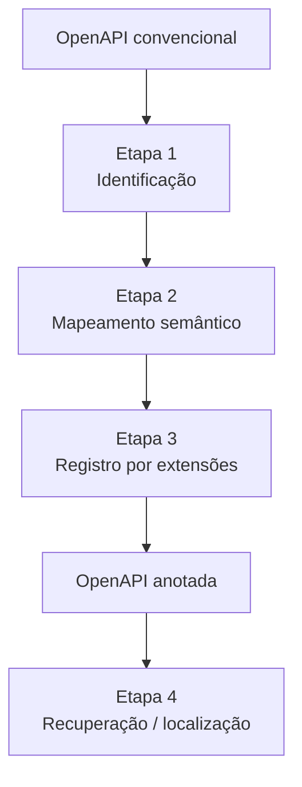

# A01 — Abordagem de Anotação Semântica para Web Services

## 1. Finalidade

A abordagem tem como objetivo **enriquecer descrições técnicas de APIs REST com informações semânticas relacionadas à privacidade de dados**, utilizando a OntoPrivacy como vocabulário conceitual de referência. O enriquecimento ocorre diretamente no documento OpenAPI, de forma complementar à documentação técnica existente.

## 2. Escopo

O artefato-alvo é uma descrição de API REST em **OpenAPI**, normalmente representada em YAML ou JSON. São particularmente relevantes:

- `paths` e operações HTTP;
- parâmetros;
- `requestBody`;
- `responses`;
- `components`;
- `schemas` e propriedades;
- referências internas `$ref`.

A abordagem permanece restrita ao que pode ser sustentado pelo contrato OpenAPI. Informações que dependam de código-fonte, banco de dados, infraestrutura, processos internos, políticas organizacionais ou interpretação jurídica especializada não devem ser presumidas.

## 3. Entradas

| Entrada | Papel |
|---|---|
| Especificação OpenAPI | artefato técnico a ser analisado |
| OntoPrivacy | vocabulário conceitual usado no mapeamento |
| contexto funcional disponível | apoio à interpretação de operações e dados |
| documentação complementar permitida pelo escopo | evidência adicional, quando explicitamente definida para a aplicação |

## 4. Processo



### 4.1 Identificação dos elementos

A primeira atividade consiste em localizar elementos potencialmente relacionados à privacidade. A inspeção não deve se limitar ao nome do endpoint ou ao método HTTP. Quando houver `$ref`, a cadeia de componentes deve ser percorrida para identificar os schemas efetivamente envolvidos nas entradas e saídas.

### 4.2 Mapeamento para a OntoPrivacy

Cada elemento candidato é analisado segundo seu significado técnico e funcional. O objetivo é verificar se existe evidência suficiente para associá-lo a um conceito da OntoPrivacy.

Exemplos de distinções relevantes:

- atributo `cpf` → pode ser associado a **Dado Pessoal**;
- schema que representa uma pessoa física → pode ser associado a **Pessoa Natural**;
- papel de **Titular de Dados Pessoais** → exige contexto relacional e não deve ser atribuído automaticamente a qualquer campo ou schema;
- operação de leitura → pode envolver **Consulta** e **Disponibilização**, conforme as perspectivas de consumidor e provedor.

### 4.3 Registro das anotações

As relações são registradas com propriedades de extensão OpenAPI prefixadas por `x-`. A abordagem considera seis propriedades descritas em `A02_EXTENSOES_OPENAPI.md`.

Exemplo simplificado:

```yaml
components:
  schemas:
    PessoaFisica:
      x-refersTo: ["Pessoa Natural"]
      properties:
        cpf:
          type: string
          x-refersTo: ["Dado Pessoal (DP)"]
```

Exemplo de operação:

```yaml
paths:
  /cob:
    post:
      x-operationType:
        - "Operação de TDP"
        - "Coleta"
        - "Armazenamento"
```

### 4.4 Recuperação das anotações

Depois do registro, as extensões podem ser localizadas por inspeção direta, scripts ou ferramentas auxiliares. Neste projeto, o Privacy Finder materializa essa etapa como mecanismo de recuperação sintática dos metadados registrados.

## 5. Saídas esperadas

A saída principal é uma **especificação OpenAPI semanticamente anotada**, preservando a estrutura funcional da API e acrescentando metadados relacionados a conceitos de privacidade.

Como saídas complementares, uma aplicação controlada deve manter:

- registro das decisões de mapeamento;
- elementos não anotados por ausência de evidência;
- pontos de validação;
- resultados quantitativos da aplicação;
- verificação estrutural do arquivo resultante.

## 6. Princípio de evidência

A regra central é: **a anotação só deve ser inserida quando o artefato fornecer evidência suficiente para sustentar a associação conceitual**. Possibilidades condicionais ou relações que dependam de informações externas devem permanecer sem anotação categórica e, quando relevantes, ser registradas como pontos de validação.

## 7. Limitações

A abordagem:

- não substitui avaliação de conformidade;
- não prova o comportamento interno do serviço;
- não determina automaticamente base legal ou consentimento;
- não transforma autenticação técnica em autorização jurídica;
- não executa inferência ontológica por si só;
- depende da qualidade e do nível de detalhe da especificação analisada.

## 8. Relação com o Estudo I

A aplicação demonstrativa da abordagem está em `EstudoI/`. Nela, a API Pix 2.6.1 foi examinada de forma controlada e a versão final utilizou apenas `x-refersTo` e `x-operationType`, pois essas propriedades foram suficientes para os mapeamentos efetivamente realizados.
