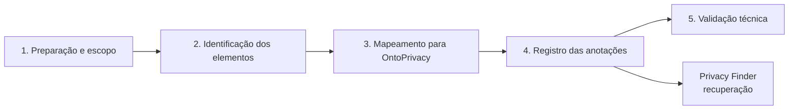

# Estudo I — Aplicação da Anotação Semântica na API Pix


Este diretório contém o **pacote reprodutível do Estudo I**, correspondente à Seção 4.2 da dissertação. O estudo aplica a abordagem definida na Seção 3.2 a uma especificação real da **API Pix**, utilizando a OntoPrivacy como vocabulário conceitual para explicitar aspectos de privacidade diretamente no contrato OpenAPI.

> [!IMPORTANT]
> O estudo demonstra aplicabilidade técnica e rastreabilidade das anotações. Ele não avalia a implementação dos serviços, não certifica conformidade com a LGPD e não representa um inventário exaustivo de todos os campos potencialmente relacionados a pessoas naturais.

## 1. Objetivo

Aplicar a abordagem de anotação semântica a uma API REST real e demonstrar como elementos técnicos de uma especificação OpenAPI podem ser associados a conceitos da OntoPrivacy, preservando a função e a estrutura do documento técnico.

## 2. Objeto de aplicação

| Item | Valor |
|---|---|
| API | API Pix |
| Fonte | Banco Central do Brasil |
| Release | 2.6.1 |
| OpenAPI | 3.0.0 |
| Paths | 16 |
| Operações HTTP | 27 |
| Schemas | 67 |
| Referências internas `$ref` | 373 |

A especificação oficial preservada neste pacote corresponde ao artefato de entrada. A versão anotada foi construída sobre essa base, com inserção controlada das extensões semânticas.

## 3. Escopo

A análise foi realizada sobre as informações representadas no contrato OpenAPI. Não fizeram parte do escopo:

- código-fonte das implementações;
- bancos de dados;
- infraestrutura;
- fluxos internos de processamento;
- políticas organizacionais dos provedores;
- determinação de base legal;
- comprovação de conformidade integral com a LGPD.

Todas as 27 operações HTTP foram examinadas. A análise de schemas e propriedades ficou delimitada aos elementos identificados e auditados durante a aplicação.

## 4. Procedimento

O Estudo I complementa as quatro atividades da abordagem com preparação inicial e validação técnica:



| Etapa | Atividade | Produto |
|---|---|---|
| 1 | preservar especificação e delimitar unidades de análise | corpus controlado |
| 2 | inspecionar operações, parâmetros, requests, responses, schemas e `$ref` | elementos candidatos |
| 3 | associar significado técnico/funcional a conceitos da OntoPrivacy | decisões de mapeamento |
| 4 | inserir `x-refersTo` e `x-operationType` | OpenAPI anotada |
| 5 | validar YAML, estrutura, referências e contagens | artefato final verificado |

## 5. Conteúdo deste diretório

```text
/EstudoI/
├── README.md
├── C01_API_PIX_Release_2.6.1.yaml
├── R01_API_PIX_Anotado.yaml
├── R02_REGISTRO_MAPEAMENTO_ANOTACOES.csv
├── R03_PONTOS_DE_VALIDACAO.csv
├── R04_RESULTADOS_SUMARIZADOS.csv
├── V01_VALIDACAO_TECNICA.md
└── V02_validar_estudo_i.py
```

### `C01_API_PIX_Release_2.6.1.yaml`

Corpus de entrada. Corresponde à especificação oficial da release 2.6.1 preservada no commit associado à release do repositório do Banco Central.

### `R01_API_PIX_Anotado.yaml`

Resultado principal da aplicação. É a versão final consolidada no projeto da dissertação e deve ser tratada como artefato canônico do Estudo I.

### `R02_REGISTRO_MAPEAMENTO_ANOTACOES.csv`

Registro estruturado das decisões. Inclui:

- todas as 27 operações HTTP e seu estado (`Anotado`, `Não anotado — evidência insuficiente` ou `Ponto de validação`);
- as 10 decisões `x-refersTo`;
- localização no YAML;
- linha do arquivo anotado;
- conceitos associados;
- evidência resumida;
- observação da decisão.

### `R03_PONTOS_DE_VALIDACAO.csv`

Consolida os cinco elementos que permaneceram sem classificação categórica por dependerem de informação adicional.

### `R04_RESULTADOS_SUMARIZADOS.csv`

Reúne resultados quantitativos, frequências conceituais e indicadores estruturais.

### `V01_VALIDACAO_TECNICA.md`

Relatório de preservação estrutural, referências internas e contagens.

### `V02_validar_estudo_i.py`

Script reprodutível para executar as verificações do relatório técnico.

## 6. Resultados consolidados

| Indicador | Resultado |
|---|---:|
| Operações anotadas | 19 |
| Operações não anotadas por ausência de evidência suficiente | 6 |
| Operações mantidas como pontos de validação | 2 |
| Operações HTTP examinadas | **27** |
| `x-operationType` | 19 |
| `x-refersTo` | 10 |
| Propriedades semânticas | **29** |
| Associações conceituais | **65** |

A porcentagem de operações anotadas é **70,37%**. Esse valor é um indicador descritivo da aplicação e não uma métrica de eficácia da abordagem.

## 7. Frequência dos conceitos

| Conceito | Associações |
|---|---:|
| Operação de Tratamento de Dados Pessoais | 19 |
| Consulta | 10 |
| Disponibilização | 10 |
| Dado Pessoal | 8 |
| Coleta | 5 |
| Armazenamento | 5 |
| Alteração | 5 |
| Exclusão | 1 |
| Pessoa Natural | 1 |
| Pessoa Jurídica | 1 |
| **Total** | **65** |

## 8. Decisões de interpretação relevantes

### Leitura: Consulta + Disponibilização

As dez operações de leitura anotadas utilizam duas perspectivas complementares: `Consulta` para a solicitação do consumidor e `Disponibilização` para a entrega do dado pelo provedor.

### Revisão: Alteração

Operações como `PATCH /cob/{txid}` e `PATCH /cobv/{txid}` foram relacionadas a `Alteração`, pois modificam cobranças existentes. A decisão foi baseada no efeito funcional, e não apenas no método HTTP.

### CPF: Dado Pessoal, não Pessoa/Titular

A propriedade `cpf` do schema `PessoaFisica` foi associada a `Dado Pessoal (DP)`. O schema agregado `PessoaFisica`, por sua vez, foi associado a `Pessoa Natural`. O papel de titular não foi presumido no campo.

### Autorização técnica não equivale a TDP Autorizado

Escopos OAuth, certificados e regras de acesso não foram utilizados como evidência de consentimento, base legal ou outra condição de legitimidade do tratamento.

## 9. Pontos de validação

Cinco elementos foram preservados como pendências controladas:

| Elemento | Motivo resumido |
|---|---|
| `WebhookCompleto.chave` | Chave Pix pode assumir tipos com naturezas distintas |
| `CobBase.chave` | valor pode identificar pessoa natural, jurídica ou depender de contexto |
| `Pix.chave` | classificação varia conforme tipo da chave e titular |
| `PUT /pix/{e2eid}/devolucao/{id}` | vínculo dos dados transacionais com pessoa natural não é explicitado |
| `GET /pix/{e2eid}/devolucao/{id}` | vinculação da resposta com pessoa natural depende do contexto operacional |

Esses registros estão detalhados em `R03_PONTOS_DE_VALIDACAO.csv`.

## 10. Validação técnica

A verificação incluída no pacote confirma:

- YAML processável;
- 16 paths preservados;
- 27 operações preservadas;
- 67 schemas preservados;
- 373 referências internas `$ref` preservadas;
- nenhuma referência interna quebrada;
- 19 `x-operationType`;
- 10 `x-refersTo`;
- 29 propriedades semânticas;
- 65 associações conceituais;
- equivalência estrutural após retirada lógica das duas extensões e normalização de espaçamento textual para fins comparativos.

Para reproduzir:

```bash
python V02_validar_estudo_i.py
```

## 11. Recuperação com o Privacy Finder

A partir de `../PrivacyFinder/`:

```bash
streamlit run app.py
```

Carregue `R01_API_PIX_Anotado.yaml` e selecione `ALL`. O resultado esperado é **29 ocorrências**. No modo `CONCEITO`, a busca por `Dado Pessoal (DP)` deve retornar **8 ocorrências**.

## 12. Limitações e ameaças à validade

| Categoria | Limitação | Mitigação documentada |
|---|---|---|
| Escopo do artefato | OpenAPI não representa todos os tratamentos internos | conclusões limitadas ao contrato analisado |
| Cobertura | schemas/propriedades não constituem inventário exaustivo | escopo explicitado e decisões registradas |
| Validade de construto | mapeamento exige interpretação | uso conjunto de descrição, requests, responses e schemas |
| Representação semântica | rótulos não expressam condição ou grau de certeza | pontos de validação e documentação complementar |
| Validade das conclusões | não foram medidas eficiência, usabilidade ou impacto sobre conformidade | conclusão restrita à aplicabilidade técnica e rastreabilidade |
| Ferramenta de apoio | Privacy Finder realiza busca sintática | ferramenta caracterizada como auxiliar de recuperação |
| Validade externa | uma única API/versão | necessidade de replicação em outros domínios |
| Confiabilidade | dependência de versões de software e evolução da API | preservação de corpus, resultado, dependências e script |

## 13. Origem do corpus

A release 2.6.1 da API Pix foi publicada pelo Banco Central do Brasil. O arquivo `C01_API_PIX_Release_2.6.1.yaml` foi preservado a partir da versão oficial correspondente à release usada no estudo.

- Repositório oficial de referência: [bacen/pix-api](https://github.com/bacen/pix-api)
- Documentação pública da API Pix: [bacen.github.io/pix-api](https://bacen.github.io/pix-api/)

## 14. Relação com o repositório histórico

O repositório [`TNK443/Streamit`](https://github.com/TNK443/Streamit) é tratado como registro da primeira publicação do Privacy Finder e de versões anteriores dos materiais. O artefato canônico deste Estudo I é **`R01_API_PIX_Anotado.yaml` deste diretório**, alinhado às decisões consolidadas no Capítulo 4 atual.
