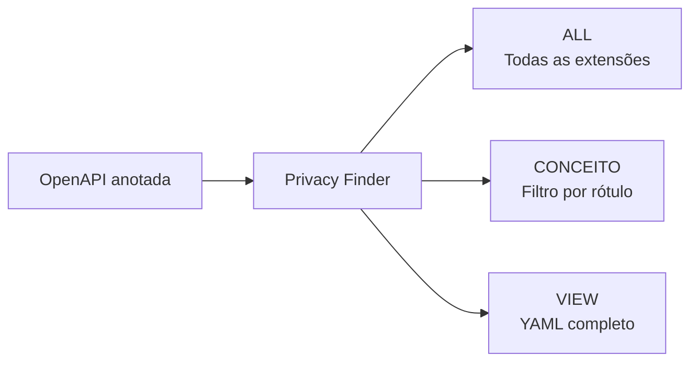

# Privacy Finder


O **Privacy Finder** é o protótipo utilizado no eixo de anotação semântica para apoiar a **localização, listagem, filtragem e visualização** das extensões registradas em especificações OpenAPI/YAML.

Este diretório contém uma **migração de compatibilidade** da primeira publicação disponível no repositório histórico [`TNK443/Streamit`](https://github.com/TNK443/Streamit). A finalidade conceitual foi preservada: o protótipo continua realizando **recuperação textual/sintática das extensões**, sem transformar a busca em inferência ontológica.

> [!IMPORTANT]
> O Privacy Finder não anota automaticamente uma API. O arquivo precisa conter previamente propriedades como `x-refersTo` ou `x-operationType`.

## Papel na abordagem



A ferramenta corresponde à atividade de **recuperação e localização** posterior ao processo de identificação, mapeamento e registro das anotações.

## Arquivos

```text
/PrivacyFinder/
├── README.md
├── app.py
├── favicon.png
├── requirements.txt
└── .streamlit/
    ├── README.md
    └── config.toml
```

| Arquivo | Papel |
|---|---|
| `app.py` | aplicação Streamlit |
| `favicon.png` | recurso visual local reutilizado a partir da OntoPrivacy; não é artefato científico separado |
| `requirements.txt` | dependências necessárias para reprodução |
| `.streamlit/config.toml` | tema visual preservado da primeira publicação |

## Origem histórica e migração

A primeira publicação do protótipo estava no repositório `TNK443/Streamit`. Para o repositório consolidado da dissertação, foram mantidos apenas os elementos ainda pertinentes à ferramenta: lógica de recuperação, configuração visual e identidade associada à OntoPrivacy.

A migração de `app.py` atualiza somente aspectos necessários à execução atual, especialmente o gerenciamento de estado da interface. O mecanismo continua intencionalmente textual: as extensões são reconhecidas por nome e sua localização é reconstruída a partir da indentação do YAML.

## Extensões reconhecidas

- `x-refersTo`
- `x-kindOf`
- `x-mapsTo`
- `x-collectionOn`
- `x-onResource`
- `x-operationType`

No Estudo I, a API Pix anotada usa somente `x-refersTo` e `x-operationType`.

## Funções

### `ALL`

Percorre os arquivos carregados e lista todas as linhas que contêm uma das extensões reconhecidas, apresentando a quantidade encontrada e o contexto hierárquico reconstruído.

### `CONCEITO`

Filtra as extensões cujo conteúdo textual contém o rótulo selecionado. Na API Pix anotada, a busca por `Dado Pessoal (DP)` deve recuperar **8 ocorrências**.

### `VIEW`

Exibe integralmente o YAML carregado para inspeção do contexto das anotações.

## Execução local

```bash
cd ANOTACAO_SEMANTICA/PrivacyFinder
python -m venv .venv
```

Ative o ambiente virtual conforme seu sistema operacional e instale as dependências:

```bash
pip install -r requirements.txt
```

Execute:

```bash
streamlit run app.py
```

Em seguida, carregue `../EstudoI/R01_API_PIX_Anotado.yaml`.

## Verificação esperada com o Estudo I

Ao carregar a versão anotada e utilizar `ALL`, o resultado esperado é:

- 19 ocorrências de `x-operationType`;
- 10 ocorrências de `x-refersTo`;
- **29 propriedades semânticas** no total.

Ao carregar a especificação original `C01_API_PIX_Release_2.6.1.yaml`, nenhuma dessas propriedades de anotação deve ser localizada.

## Limitações deliberadas

A ferramenta **não**:

- resolve referências `$ref`;
- consulta uma versão operacional da OntoPrivacy;
- percorre subclasses ou relações ontológicas;
- executa inferência;
- decide se uma anotação está correta;
- identifica automaticamente novos dados pessoais;
- verifica conformidade com a LGPD.

O valor semântico decorre do processo de anotação e dos conceitos da OntoPrivacy; o Privacy Finder oferece uma camada de exploração sobre os metadados já inseridos.

## Reprodutibilidade

A versão de Streamlit foi fixada no `requirements.txt` para reduzir a instabilidade de interface observada em versões futuras. A validação estrutural do Estudo I é independente do Privacy Finder e está documentada em `../EstudoI/V01_VALIDACAO_TECNICA.md`.
