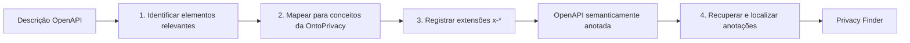
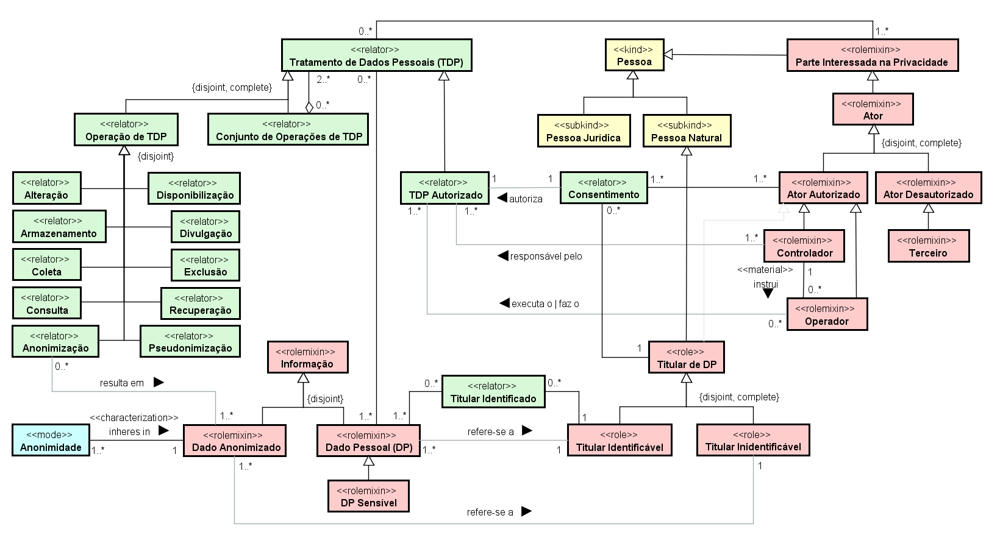

# Anotação Semântica para Web Services / OpenAPI


Este diretório reúne os materiais correspondentes à **abordagem de anotação semântica para Web Services**, apresentada na **Seção 3.2 da dissertação**, e sua ligação com o **Estudo I**, apresentado na Seção 4.2.

A proposta utiliza a **OntoPrivacy** como vocabulário conceitual de referência para associar elementos técnicos de especificações **OpenAPI** a conceitos do domínio da privacidade de dados. O objetivo é acrescentar uma camada semântica ao contrato da API sem substituir sua função original de documentação técnica.

> [!NOTE]
> A abordagem é voltada à explicitação e à rastreabilidade de aspectos de privacidade no artefato OpenAPI. Ela **não executa automaticamente uma verificação completa de conformidade com a LGPD**.

## Relação com a dissertação

| Elemento | Correspondência |
|---|---|
| OntoPrivacy | Seção 3.1 — base semântica |
| Abordagem de anotação | Seção 3.2 — OE02(a) |
| Aplicação na API Pix | Seção 4.2 — Estudo I / OE03 |
| Privacy Finder | mecanismo auxiliar de recuperação das anotações |

## Visão da abordagem



A sequência de referência é composta por quatro atividades:

1. **Identificação dos elementos da descrição OpenAPI:** análise de `paths`, operações HTTP, parâmetros, `requestBody`, `responses`, `components`, `schemas` e referências internas.
2. **Mapeamento para a OntoPrivacy:** associação do significado técnico/funcional a conceitos do domínio, preservando diferenças entre dados, entidades, papéis e operações de tratamento.
3. **Registro das anotações:** utilização de extensões OpenAPI prefixadas por `x-`.
4. **Recuperação:** localização e filtragem dos metadados previamente registrados.

## Estrutura deste diretório

```text
/ANOTACAO_SEMANTICA/
├── README.md
├── A01_ABORDAGEM_ANOTACAO_SEMANTICA.md
├── A02_EXTENSOES_OPENAPI.md
├── A03_CRITERIOS_DE_MAPEAMENTO.md
├── OntoPrivacy_v1.png
├── PrivacyFinder/
│   ├── README.md
│   ├── app.py
│   ├── favicon.png
│   ├── requirements.txt
│   └── .streamlit/
│       ├── README.md
│       └── config.toml
└── EstudoI/
    ├── README.md
    ├── C01_API_PIX_Release_2.6.1.yaml
    ├── R01_API_PIX_Anotado.yaml
    ├── R02_REGISTRO_MAPEAMENTO_ANOTACOES.csv
    ├── R03_PONTOS_DE_VALIDACAO.csv
    ├── R04_RESULTADOS_SUMARIZADOS.csv
    ├── V01_VALIDACAO_TECNICA.md
    └── V02_validar_estudo_i.py
```

## Documentos da abordagem

### [`A01_ABORDAGEM_ANOTACAO_SEMANTICA.md`](./A01_ABORDAGEM_ANOTACAO_SEMANTICA.md)

Apresenta objetivo, escopo, entradas, processo, saídas e limites da abordagem de forma autocontida, funcionando como documentação técnica resumida da Seção 3.2.

### [`A02_EXTENSOES_OPENAPI.md`](./A02_EXTENSOES_OPENAPI.md)

Documenta as seis propriedades de extensão consideradas pela abordagem: `x-refersTo`, `x-kindOf`, `x-mapsTo`, `x-collectionOn`, `x-onResource` e `x-operationType`. O Estudo I emprega efetivamente apenas `x-refersTo` e `x-operationType`.

### [`A03_CRITERIOS_DE_MAPEAMENTO.md`](./A03_CRITERIOS_DE_MAPEAMENTO.md)

Consolida os critérios de decisão utilizados para reduzir interpretações excessivas, incluindo regras para métodos HTTP, cadeias `$ref`, distinção entre dado e entidade, autorização técnica, Chave Pix e ausência de evidência.

## OntoPrivacy

<p align="center">
  
</p>

`OntoPrivacy_v1.png` é a referência visual canônica da ontologia utilizada neste eixo. Ela deve ser consultada em conjunto com os documentos da dissertação quando houver dúvida sobre natureza conceitual, papel ou relação entre os elementos usados nas anotações.

> [!IMPORTANT]
> Rótulos registrados no YAML funcionam como vínculos textuais com a OntoPrivacy. Nesta versão, eles não constituem URIs ontológicas estáveis nem habilitam inferência automática.

## Privacy Finder

O diretório [`PrivacyFinder/`](./PrivacyFinder/) contém a versão migrada do protótipo publicado originalmente no repositório histórico `TNK443/Streamit`. Sua finalidade permanece a mesma: **localizar e apresentar extensões já existentes em arquivos YAML**.

A ferramenta reconhece as propriedades da abordagem e oferece três modos de exploração:

| Função | Finalidade |
|---|---|
| `ALL` | listar todas as propriedades de anotação reconhecidas |
| `CONCEITO` | filtrar ocorrências que contenham determinado rótulo |
| `VIEW` | visualizar integralmente o YAML carregado |

## Estudo I — API Pix

O diretório [`EstudoI/`](./EstudoI/) contém a aplicação demonstrativa da abordagem sobre a **API Pix release 2.6.1**, descrita em **OpenAPI 3.0.0**. O pacote preserva separadamente o corpus original, o resultado anotado, o registro das decisões, os pontos de validação e a verificação técnica.

### Resultados consolidados

| Indicador | Resultado |
|---|---:|
| Operações HTTP examinadas | 27 |
| Operações anotadas | 19 |
| Operações não anotadas por ausência de evidência suficiente | 6 |
| Operações mantidas como pontos de validação | 2 |
| `x-operationType` | 19 |
| `x-refersTo` | 10 |
| Propriedades semânticas | 29 |
| Associações conceituais | 65 |

## O que a abordagem permite afirmar

A aplicação sustenta a **viabilidade técnica de acrescentar metadados de privacidade a uma especificação OpenAPI real**, preservando sua estrutura funcional e permitindo posterior recuperação dos vínculos inseridos.

## O que a abordagem não permite afirmar

- que toda operação não anotada não trate dados pessoais;
- que a anotação cubra todos os schemas e propriedades possíveis;
- que OAuth, certificado ou controle de acesso comprove uma condição jurídica de tratamento;
- que os serviços ou a API Pix estejam integralmente em conformidade com a LGPD;
- que o Privacy Finder descubra automaticamente tratamentos ou execute raciocínio ontológico.

## Ordem recomendada de leitura

1. `A01_ABORDAGEM_ANOTACAO_SEMANTICA.md`;
2. `A02_EXTENSOES_OPENAPI.md`;
3. `A03_CRITERIOS_DE_MAPEAMENTO.md`;
4. `EstudoI/README.md`;
5. `PrivacyFinder/README.md`.
