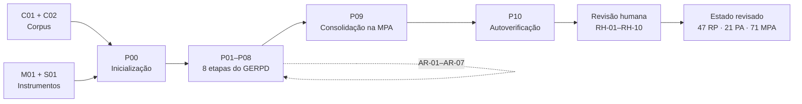
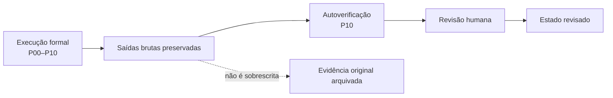

<div align="center">

# 🧪 Estudo II — Aplicação demonstrativa do GERPD com apoio do ChatGPT no projeto Tibico

**Pacote científico completo da aplicação do Guia para Engenharia de Requisitos de Privacidade de Dados (GERPD) sobre artefatos de Engenharia de Software**


**Execução formal: 10 de agosto de 2026 · Versão do estudo: 1.0**

</div>

---

## 📌 Sobre este diretório

Este diretório reúne os materiais necessários para **compreender, auditar e reproduzir metodologicamente** o **Estudo II** da dissertação, no qual o **Guia para Engenharia de Requisitos de Privacidade de Dados (GERPD) v1.0** foi aplicado integralmente, com apoio do **ChatGPT**, a artefatos de Engenharia de Software do projeto acadêmico **Tibico**.

O Estudo II foi estruturado como uma **aplicação demonstrativa, de caráter exploratório e descritivo**, organizada como demonstração processual do GERPD. O interesse principal está na operacionalização do guia: observar como suas oito etapas podem ser percorridas sobre um mesmo corpus, quais informações são progressivamente estruturadas, como os retornos entre etapas são registrados e de que forma os resultados são consolidados e posteriormente revisados.

> [!IMPORTANT]
> O objeto principal do estudo é a **aplicação do GERPD**. O ChatGPT atua como recurso de apoio à execução das instruções do guia e **não constitui, isoladamente, o objeto de avaliação**.

O repositório preserva separadamente:

- os **artefatos de entrada** utilizados na execução;
- os **prompts P00–P10**;
- as **respostas brutas, completas e não editadas**;
- as **saídas completas das oito etapas**;
- os **Adendos de Retorno (AR-01–AR-07)**;
- a **Matriz de Rastreabilidade bruta e revisada**;
- a **revisão humana RH-01–RH-10**;
- a **MPA bruta e a MPA revisada**;
- a **autoverificação diagnóstica P10**;
- os **indicadores consolidados**;
- documentação para **auditoria e reprodução metodológica**.

---

## 🎯 Objetivo do Estudo II

O objetivo do Estudo II é:

> **Demonstrar e analisar a aplicação integral do GERPD, com apoio de IA Generativa (ChatGPT), sobre artefatos de Engenharia de Software do projeto Tibico, percorrendo todas as etapas do guia, registrando suas entradas, atividades, decisões e saídas intermediárias, e consolidando os resultados na MPA, de modo a evidenciar como o GERPD e a OntoPrivacy podem apoiar a identificação, a organização, a especificação e a rastreabilidade de requisitos de privacidade.**

### Questão orientadora

> **Como o GERPD pode ser operacionalizado, com apoio do ChatGPT, na análise de artefatos de Engenharia de Software do projeto Tibico, e quais saídas, requisitos candidatos, vínculos de rastreabilidade, lacunas e pontos de validação são produzidos ao longo de suas etapas e na consolidação final da MPA?**

---

## 🧭 Delineamento do estudo

| Elemento | Delineamento adotado |
|---|---|
| **Natureza** | Aplicação demonstrativa, de caráter exploratório e descritivo |
| **Unidade de análise** | Sistema Tibico conforme representado no corpus documental selecionado |
| **Aplicações formais** | **1** aplicação completa e encadeada |
| **Ambiente de execução** | Uma única conversa no ChatGPT, com contexto acumulado |
| **Modelo registrado na execução** | **GPT-5.6 Sol** |
| **Sequência formal** | **P00 → P01 → P02 → P03 → P04 → P05 → P06 → P07 → P08 → P09 → P10** |
| **Etapas do GERPD** | **P01–P08**, totalizando 8/8 etapas |
| **P09** | Consolidação posterior das saídas na MPA |
| **P10** | Autoverificação diagnóstica |
| **Base semântica** | OntoPrivacy v1 |
| **Instrumento metodológico** | GERPD v1.0 |
| **Revisão humana** | Realizada somente após o encerramento de P10 |
| **Intervenção analítica humana durante P00–P10** | Não |
| **Fontes externas para completar informações sobre o Tibico** | Não utilizadas na cadeia formal |
| **Preservação das saídas brutas** | Sim |

> [!NOTE]
> O envio sequencial dos prompts congelados pelo pesquisador não é tratado como intervenção analítica entre as respostas. A revisão analítica humana foi realizada **posteriormente**, depois do encerramento de P10.

---

# 🔄 Visão geral da execução



### Separação entre evidência bruta e revisão



> [!IMPORTANT]
> A **autoverificação P10 não corrige retroativamente** as respostas anteriores. A **revisão humana também não sobrescreve** o estado bruto: ambos os estados permanecem documentados separadamente.

---

# 📚 Corpus e instrumentos

A aplicação utilizou dois artefatos como **corpus documental** e dois artefatos como **instrumentos congelados de orientação**.

| ID | Artefato | Versão | Papel | Arquivo |
|---|---|---|---|---|
| **C01** | Documento de Requisitos do Tibico | v1.3 | Corpus: propósito, minimundo, requisitos funcionais, regras de negócio e requisitos não funcionais | [`C01_TIB-REQ_Documento-de-Requisitos_v1.3.pdf`](01_Corpus_e_Instrumentos/C01_TIB-REQ_Documento-de-Requisitos_v1.3.pdf) |
| **C02** | Documento de Especificação de Requisitos do Tibico | v1.2 | Corpus: subsistemas, atores, casos de uso, fluxos, modelos, restrições e dicionário de dados | [`C02_TIB-ANL_Especificacao-de-Requisitos_v1.2.pdf`](01_Corpus_e_Instrumentos/C02_TIB-ANL_Especificacao-de-Requisitos_v1.2.pdf) |
| **M01** | Guia para Engenharia de Requisitos de Privacidade de Dados | v1.0 | Instrumento metodológico | [`M01_GERPD_v1.0.pdf`](01_Corpus_e_Instrumentos/M01_GERPD_v1.0.pdf) |
| **S01** | OntoPrivacy | v1 | Instrumento semântico | [`S01_OntoPrivacy_v1.png`](01_Corpus_e_Instrumentos/S01_OntoPrivacy_v1.png) |

O corpus é considerado **integralmente**. C01 e C02 são tratados como artefatos complementares e constituem a única fonte para afirmações sobre o sistema Tibico durante a cadeia formal P00–P10.

> [!CAUTION]
> A ausência de uma informação em C01 ou C02 **não permite concluir que ela inexista no sistema ou na organização**. Nesses casos, o GERPD orienta o registro como informação não identificada, elemento a verificar, lacuna ou ponto de validação.

---

# 🧠 Arquitetura dos prompts P00–P10

| Prompt | Função | Relação com o GERPD | Principal produto |
|---|---|---|---|
| **P00** | Inicializar e validar o contexto formal da execução | Preparação | Confirmação de corpus, instrumentos, escopo e regras globais |
| **P01** | Delimitar o contexto | Etapa 1 | `AN-01` |
| **P02** | Mapear dados pessoais | Etapa 2 | `DP-01–DP-37` |
| **P03** | Identificar titulares, agentes e papéis | Etapa 3 | `AG-01–AG-09` |
| **P04** | Caracterizar operações de tratamento | Etapa 4 | `OP-01–OP-41` |
| **P05** | Analisar finalidade, autorização e condições | Etapa 5 | `FA-01–FA-43` |
| **P06** | Derivar requisitos de privacidade | Etapa 6 | Requisitos candidatos `RP-xx` |
| **P07** | Registrar rastreabilidade | Etapa 7 | Matriz de Rastreabilidade |
| **P08** | Validar, revisar e registrar pontos de atenção | Etapa 8 | `PA-01–PA-20` + retornos e complementações |
| **P09** | Consolidar os achados | Consolidação posterior | MPA bruta `MPA-01–MPA-68` |
| **P10** | Realizar autoverificação diagnóstica | Verificação posterior | Relatório de autoverificação |

Os textos exatos dos prompts estão disponíveis em [`02_Prompts/`](02_Prompts/), enquanto as respostas originais estão em [`03_Respostas_Brutas/`](03_Respostas_Brutas/).

---

# 🧱 Oito etapas do GERPD na aplicação

| Etapa | Saída principal | Resultado bruto |
|---:|---|---:|
| **1** | Caracterização do contexto | **AN-01** |
| **2** | Dados pessoais | **37 DP** |
| **3** | Titulares, agentes e papéis | **9 AG** |
| **4** | Operações de tratamento | **41 OP** |
| **5** | Finalidades, autorização e condições | **43 FA** |
| **6** | Requisitos candidatos de privacidade | **45 RP acumulados ao final da execução** |
| **7** | Matriz de Rastreabilidade | **45 requisitos rastreados** |
| **8** | Pontos de atenção e validação | **20 PA** |
| — | Consolidação posterior | **68 registros na MPA bruta** |

As saídas completas podem ser consultadas em [`04_Saidas_Etapas/`](04_Saidas_Etapas/).

---

# 🔁 Adendos de Retorno — AR-01 a AR-07

O GERPD possui natureza iterativa. Durante a aplicação, achados posteriores exigiram refinamentos ou complementações de saídas anteriores. Esses movimentos foram preservados como **Adendos de Retorno (AR)**, em vez de substituírem silenciosamente os registros originais.

Foram registrados **sete adendos**:

| ID | Síntese |
|---|---|
| **AR-01** | Complementação do contexto a partir da identificação dos nomes de pai e mãe como dados de pessoas naturais relacionadas ao cenário |
| **AR-02** | Refinamento de `OP-20`, retirando o nome do professor como dado confirmado na alocação e mantendo apenas os elementos sustentados pelos artefatos |
| **AR-03** | Refinamento de `FA-17`, distinguindo a necessidade funcional de autenticação da necessidade específica de utilizar matrícula/CPF como identificadores |
| **AR-04** | Inclusão de `RP-44`, relativo à justificativa do uso de matrícula/CPF como nome de usuário |
| **AR-05** | Propagação da rastreabilidade associada a `RP-44` |
| **AR-06** | Inclusão de `RP-45`, relativo à necessidade de cada dado pessoal em relatórios/exportações |
| **AR-07** | Propagação da rastreabilidade associada a `RP-45` |

Os registros completos estão em [`05_Adendos_Retorno/`](05_Adendos_Retorno/).

---

# 🔗 Rastreabilidade

A **Matriz de Rastreabilidade** é produto da Etapa 7 e é centrada nos requisitos candidatos. Ela permanece distinta da MPA.

O repositório mantém dois estados:

| Estado | Requisitos | Status |
|---|---:|---|
| **Bruto acumulado** | **45** | 8 Completo · 13 Parcial · 24 A validar |
| **Revisado** | **47** | 10 Completo · 13 Parcial · 24 A validar |

Arquivos disponíveis em [`06_Rastreabilidade/`](06_Rastreabilidade/):

- Matriz bruta acumulada em **XLSX, CSV e Markdown**;
- Matriz revisada em **XLSX e CSV**.

> [!NOTE]
> Os status `Completo`, `Parcial` e `A validar` caracterizam a **rastreabilidade do requisito** e não representam conformidade jurídica ou qualidade global do requisito.

---

# 📋 Matriz Padrão de Aplicação — MPA

A **MPA** é produzida **após as oito etapas** e consolida os diferentes tipos de achado em uma estrutura integrada. Cada registro representa um **achado de privacidade rastreável**.

O Estudo II preserva duas versões:

| Versão | Registros | Papel |
|---|---:|---|
| **MPA bruta** | **68** | Estado produzido ao final de P09, antes da revisão humana |
| **MPA revisada** | **71** | Estado posterior à revisão humana |

Arquivos disponíveis em [`08_MPA/`](08_MPA/):

- `MPA_Bruta_EstudoII_v1.0.xlsx`
- `MPA_Bruta_EstudoII_v1.0.csv`
- `MPA_Bruta_EstudoII_v1.0.md`
- `MPA_Revisada_EstudoII_v1.0.xlsx`
- `MPA_Revisada_EstudoII_v1.0.csv`

---

# 👁️ Autoverificação P10

O Prompt 10 foi utilizado como **autoverificação diagnóstica** da própria aplicação. Ele não alterou as respostas anteriores e não foi tratado como revisão humana.

O diagnóstico considerou os cinco critérios qualitativos do GERPD:

| Critério | Diagnóstico P10 |
|---|---|
| **Completude** | Parcial |
| **Correção conceitual** | Parcial |
| **Rastreabilidade** | Parcial |
| **Utilidade** | Adequado |
| **Clareza** | Parcial |

Entre as fragilidades diagnosticadas estiveram omissões de elementos do corpus, classificações conceituais discutíveis, inferências de responsabilidade, distinções entre operação e finalidade e questões de granularidade na MPA.

O relatório integral está em [`09_Autoverificacao/P10_Relatorio_Autoverificacao_Completo.md`](09_Autoverificacao/P10_Relatorio_Autoverificacao_Completo.md).

> [!WARNING]
> A sobreposição entre problemas indicados em P10 e ajustes confirmados posteriormente pela revisão humana **não deve ser interpretada como medida independente de capacidade de detecção do modelo**, pois o pesquisador conhecia o diagnóstico antes de realizar a revisão.

---

# 👤 Revisão humana

Após o encerramento de P10, as saídas foram submetidas a uma **revisão humana controlada**. Essa revisão foi registrada em `RH-01–RH-10` e manteve separadas as evidências brutas e as decisões posteriores.

As decisões possíveis foram:

| Status | Significado |
|---|---|
| **Aceito** | Achado sustentado sem necessidade de alteração |
| **Aceito com ajustes** | Núcleo do achado preservado, com refinamento de classificação, formulação, evidência ou vínculo |
| **Rejeitado** | Achado sem sustentação suficiente, fora do escopo ou conceitualmente inadequado |
| **Pendente de validação** | Decisão depende de informação adicional ou de parte interessada/especialista |

Os registros completos encontram-se em [`07_Revisao_Humana/`](07_Revisao_Humana/).

### Principais efeitos da revisão

- `RP-01–RP-45` → **RP-01–RP-47**;
- `PA-01–PA-20` → **PA-01–PA-21**;
- `MPA-01–MPA-68` → **MPA-01–MPA-71**;
- inclusão de `RP-46` e `RP-47` a partir das restrições `RI05` e `RI06`;
- inclusão de `PA-21` para registrar divergência relacionada ao fechamento de período;
- refinamentos em responsabilidade/competência, finalidade, precisão conceitual e granularidade.

---

# 📊 Resultados consolidados

## Evolução das principais saídas

| Elemento | Estado bruto | Estado revisado |
|---|---:|---:|
| **AN** | 1 | 1 |
| **DP** | 37 | 37 |
| **AG** | 9 | 9 |
| **OP** | 41 | 41, com refinamentos conceituais |
| **FA** | 43 | 43, com ajustes |
| **RP** | **45** | **47** |
| **PA** | **20** | **21** |
| **AR** | 7 | preservados |
| **MPA** | **68** | **71** |
| **RH** | — | **10** |

## Resultado da revisão dos 68 registros da MPA bruta

| Decisão | Quantidade | Percentual |
|---|---:|---:|
| **Aceito** | 28 | 41,2% |
| **Aceito com ajustes** | 39 | 57,4% |
| **Pendente de validação** | 1 | 1,5% |
| **Rejeitado** | 0 | 0,0% |
| **Total** | **68** | **100%** |

> [!IMPORTANT]
> Essas proporções descrevem o **resultado da revisão humana nesta aplicação específica**. Elas **não representam taxa de acurácia, taxa de erro ou desempenho geral do ChatGPT**.

## Natureza predominante dos 39 ajustes

| Natureza do ajuste | Quantidade | Percentual |
|---|---:|---:|
| **Responsabilidade / competência** | 22 | 56,4% |
| **Correção conceitual / ontológica** | 7 | 17,9% |
| **Finalidade** | 4 | 10,3% |
| **Granularidade** | 3 | 7,7% |
| **Terminologia / identificação de participante** | 2 | 5,1% |
| **Evidência / necessidade** | 1 | 2,6% |
| **Total** | **39** | **100%** |

Os dados consolidados também estão disponíveis em formatos legíveis por máquina em [`10_Indicadores/`](10_Indicadores/).

---

# 🆔 Glossário de identificadores

| Prefixo | Significado | Origem |
|---|---|---|
| **AN** | Análise / caracterização do contexto | Etapa 1 |
| **DP** | Dado pessoal identificado | Etapa 2 |
| **AG** | Titular, agente, ator ou papel identificado | Etapa 3 |
| **OP** | Operação de tratamento | Etapa 4 |
| **FA** | Finalidade, autorização e condição | Etapa 5 |
| **RP** | Requisito candidato de privacidade | Etapa 6 / complementações posteriores |
| **PA** | Ponto de atenção / necessidade de validação | Etapa 8 |
| **AR** | Adendo de Retorno | Retorno entre etapas |
| **MPA** | Achado consolidado na Matriz Padrão de Aplicação | Consolidação posterior |
| **RH** | Registro da revisão humana | Revisão posterior a P10 |

Para uma descrição ampliada, consulte [`00_Documentacao/GLOSSARIO_IDENTIFICADORES.md`](00_Documentacao/GLOSSARIO_IDENTIFICADORES.md).

---

# 📂 Estrutura completa do diretório

```text
EstudoII/
│
├── README.md
│
├── 00_Documentacao/
│   ├── README.md
│   ├── Protocolo_Prompts_EstudoII_v1.0.pdf
│   ├── METADADOS_EXECUCAO_EstudoII.json
│   ├── GLOSSARIO_IDENTIFICADORES.md
│   └── MAPA_ARTEFATOS_ESTUDOII.md
│
├── 01_Corpus_e_Instrumentos/
│   ├── README.md
│   ├── C01_TIB-REQ_Documento-de-Requisitos_v1.3.pdf
│   ├── C02_TIB-ANL_Especificacao-de-Requisitos_v1.2.pdf
│   ├── M01_GERPD_v1.0.pdf
│   └── S01_OntoPrivacy_v1.png
│
├── 02_Prompts/
│   ├── README.md
│   ├── P00_PROMPT.md
│   ├── P01_PROMPT.md
│   ├── P02_PROMPT.md
│   ├── P03_PROMPT.md
│   ├── P04_PROMPT.md
│   ├── P05_PROMPT.md
│   ├── P06_PROMPT.md
│   ├── P07_PROMPT.md
│   ├── P08_PROMPT.md
│   ├── P09_PROMPT.md
│   └── P10_PROMPT.md
│
├── 03_Respostas_Brutas/
│   ├── README.md
│   ├── P00_RESPOSTA_BRUTA.md
│   ├── P01_RESPOSTA_BRUTA.md
│   ├── P02_RESPOSTA_BRUTA.md
│   ├── P03_RESPOSTA_BRUTA.md
│   ├── P04_RESPOSTA_BRUTA.md
│   ├── P05_RESPOSTA_BRUTA.md
│   ├── P06_RESPOSTA_BRUTA.md
│   ├── P07_RESPOSTA_BRUTA.md
│   ├── P08_RESPOSTA_BRUTA.md
│   ├── P09_RESPOSTA_BRUTA.md
│   ├── P10_RESPOSTA_BRUTA.md
│   └── EXECUCAO_COMPLETA_P00-P10.md
│
├── 04_Saidas_Etapas/
│   ├── README.md
│   ├── E01_Delimitar_Contexto.md
│   ├── E02_Mapear_Dados_Pessoais.md
│   ├── E03_Titulares_Agentes_Papeis.md
│   ├── E04_Operacoes_Tratamento.md
│   ├── E05_Finalidade_Autorizacao_Condicoes.md
│   ├── E06_Requisitos_Privacidade.md
│   ├── E07_Rastreabilidade.md
│   ├── E08_Pontos_Atencao.md
│   ├── Estado_Acumulado_Bruto_Etapas_1a8.md
│   └── Saidas_Etapas_1a8_EstudoII_v1.0.xlsx
│
├── 05_Adendos_Retorno/
│   ├── README.md
│   ├── AR-01.md
│   ├── AR-02.md
│   ├── AR-03.md
│   ├── AR-04.md
│   ├── AR-05.md
│   ├── AR-06.md
│   ├── AR-07.md
│   ├── Adendos_AR01_AR07_Completo.md
│   └── Adendos_Retorno_EstudoII_v1.0.csv
│
├── 06_Rastreabilidade/
│   ├── README.md
│   ├── Matriz_Rastreabilidade_Bruta_Acumulada_EstudoII_v1.0.xlsx
│   ├── Matriz_Rastreabilidade_Bruta_Acumulada_EstudoII_v1.0.csv
│   ├── Matriz_Rastreabilidade_Bruta_Acumulada_EstudoII_v1.0.md
│   ├── Matriz_Rastreabilidade_Revisada_EstudoII_v1.0.xlsx
│   └── Matriz_Rastreabilidade_Revisada_EstudoII_v1.0.csv
│
├── 07_Revisao_Humana/
│   ├── README.md
│   ├── Matriz_Revisao_Humana_RH01-RH10_EstudoII_v1.0.xlsx
│   ├── Matriz_Revisao_Humana_RH01-RH10_EstudoII_v1.0.csv
│   ├── Matriz_Revisao_Humana_RH01_RH10.md
│   └── Estado_Humano_Revisado_Etapas_1a8.md
│
├── 08_MPA/
│   ├── README.md
│   ├── MPA_Bruta_EstudoII_v1.0.xlsx
│   ├── MPA_Bruta_EstudoII_v1.0.csv
│   ├── MPA_Bruta_EstudoII_v1.0.md
│   ├── MPA_Revisada_EstudoII_v1.0.xlsx
│   └── MPA_Revisada_EstudoII_v1.0.csv
│
├── 09_Autoverificacao/
│   ├── README.md
│   └── P10_Relatorio_Autoverificacao_Completo.md
│
├── 10_Indicadores/
│   ├── README.md
│   ├── Indicadores_Consolidados_EstudoII_v1.0.xlsx
│   ├── Indicadores_Consolidados_EstudoII_v1.0.csv
│   ├── Indicadores_Consolidados_EstudoII_v1.0.json
│   └── Indicadores_Consolidados_EstudoII_v1.0.md
│
├── 11_Figuras/
│   ├── README.md
│   ├── Figura 4.3.1 Protocolo Execucao EstudoII.png
│   ├── Figura 4.3.2 Encadeamento das oito etapas.png
│   ├── Figura 4.3.3 Camadas do resultado do Estudo II.png
│   ├── Figura 4.3.4 Evolucao quantitativa das saidas.png
│   ├── Figura 4.3.5 Resultado da revisao da MPA.png
│   └── Figura 4.3.6 Natureza dos ajustes humanos.png
│
└── 12_Reprodutibilidade/
    ├── README.md
    ├── COMO_REPRODUZIR_ESTUDOII.md
    ├── VERSIONAMENTO.md
    └── RELACAO_ARQUIVOS_SECAO_4.3.md
```

> [!NOTE]
> Nenhum.

---

# 🗂️ Navegação rápida

| Quero... | Diretório recomendado |
|---|---|
| entender o delineamento e o protocolo | [`00_Documentacao/`](00_Documentacao/) |
| conferir exatamente o corpus e os instrumentos | [`01_Corpus_e_Instrumentos/`](01_Corpus_e_Instrumentos/) |
| ler o que foi enviado ao ChatGPT | [`02_Prompts/`](02_Prompts/) |
| ler as respostas originais, sem edição | [`03_Respostas_Brutas/`](03_Respostas_Brutas/) |
| examinar as oito etapas isoladamente | [`04_Saidas_Etapas/`](04_Saidas_Etapas/) |
| compreender os retornos entre etapas | [`05_Adendos_Retorno/`](05_Adendos_Retorno/) |
| auditar requisitos e seus vínculos | [`06_Rastreabilidade/`](06_Rastreabilidade/) |
| verificar o que foi alterado pelo pesquisador | [`07_Revisao_Humana/`](07_Revisao_Humana/) |
| comparar MPA bruta e revisada | [`08_MPA/`](08_MPA/) |
| ler o autodiagnóstico completo do modelo | [`09_Autoverificacao/`](09_Autoverificacao/) |
| utilizar os indicadores em análise automatizada | [`10_Indicadores/`](10_Indicadores/) |
| consultar as figuras do Estudo II | [`11_Figuras/`](11_Figuras/) |
| reproduzir/auditar metodologicamente a aplicação | [`12_Reprodutibilidade/`](12_Reprodutibilidade/) |

---

# 🧾 Proveniência dos arquivos

Os materiais do repositório não possuem todos a mesma natureza. Para facilitar auditoria, eles devem ser interpretados segundo sua proveniência:

| Categoria | Significado | Exemplos |
|---|---|---|
| **Entrada congelada** | Arquivo utilizado diretamente na execução formal | C01, C02, M01, S01 |
| **Prompt congelado** | Instrução previamente definida e enviada ao modelo | P00–P10 |
| **Evidência bruta** | Resposta original preservada sem edição | `Pxx_RESPOSTA_BRUTA.md` |
| **Extração organizada** | Reprodução/organização objetiva de informação já existente na evidência bruta | Saídas E01–E08, AR, exportações tabulares |
| **Revisão humana** | Decisão analítica realizada posteriormente pelo pesquisador | RH-01–RH-10, MPA revisada |
| **Derivado analítico** | Síntese ou conversão produzida a partir de dados já validados | CSV, JSON, indicadores |

> [!IMPORTANT]
> Em caso de divergência interpretativa, a **resposta bruta original** é a evidência primária da execução do ChatGPT; os arquivos revisados documentam explicitamente as decisões humanas posteriores.

---

# 🔬 Como reproduzir metodologicamente

O procedimento completo está disponível em:

➡️ [`12_Reprodutibilidade/COMO_REPRODUZIR_ESTUDOII.md`](12_Reprodutibilidade/COMO_REPRODUZIR_ESTUDOII.md)

Em síntese:

1. utilizar exatamente C01, C02, M01 e S01;
2. iniciar uma nova conversa sem contexto analítico anterior;
3. executar P00–P10 na ordem estabelecida;
4. aguardar a resposta integral de cada prompt antes do próximo;
5. não inserir correções ou comentários analíticos entre P00 e P10;
6. preservar integralmente as respostas;
7. manter eventuais Adendos de Retorno sem apagar a saída anterior;
8. tratar P09 como consolidação posterior, e não como nona etapa do GERPD;
9. tratar P10 como diagnóstico, e não como correção retroativa;
10. realizar eventual revisão humana somente depois do encerramento da execução formal.

### O que significa “reproduzir” neste estudo?

Uma nova execução deve ser comparada principalmente quanto a:

- cumprimento das oito etapas;
- sequência P00–P10;
- uso dos tipos de identificadores previstos;
- separação entre Matriz de Rastreabilidade e MPA;
- preservação de lacunas e incertezas;
- ausência de intervenção analítica humana entre P00 e P10;
- separação entre autoverificação e revisão humana.

Diferenças de redação, quantidade ou granularidade de achados podem ocorrer e devem ser **documentadas**, não ocultadas.

> [!WARNING]
> Modelos de IA Generativa podem apresentar variabilidade entre execuções e versões. Este repositório busca favorecer **reprodução metodológica e auditabilidade**, e não garantir reprodução textual idêntica.

---

# 📖 Relação com a Seção 4.3 da dissertação

| Subseção | Conteúdo principal | Materiais do repositório |
|---|---|---|
| **4.3.1** | Objetivo, natureza e escopo | `00_Documentacao/` |
| **4.3.2** | Corpus e instrumentos | `01_Corpus_e_Instrumentos/` |
| **4.3.3** | Protocolo e procedimento de execução | `00_Documentacao/`, `02_Prompts/`, `03_Respostas_Brutas/` |
| **4.3.4** | Aplicação das oito etapas | `04_Saidas_Etapas/`, `05_Adendos_Retorno/`, `06_Rastreabilidade/` |
| **4.3.5** | Consolidação na MPA | `08_MPA/` |
| **4.3.6** | Autoverificação e revisão humana | `07_Revisao_Humana/`, `09_Autoverificacao/` |
| **4.3.7** | Síntese dos resultados | `10_Indicadores/`, `11_Figuras/` |
| **4.3.8** | Análise dos resultados | resultados consolidados dos diretórios anteriores |
| **4.3.9** | Limitações e ameaças à validade | `12_Reprodutibilidade/` e documentação metodológica |

Para o mapeamento detalhado, consulte [`12_Reprodutibilidade/RELACAO_ARQUIVOS_SECAO_4.3.md`](12_Reprodutibilidade/RELACAO_ARQUIVOS_SECAO_4.3.md).

---

# ⚠️ Limites de interpretação

O Estudo II **não foi concebido** para:

- comprovar a conformidade do Tibico com a LGPD;
- certificar bases legais ou condições jurídicas de tratamento;
- avaliar qual ferramenta ou modelo de IA é superior;
- medir acurácia geral do ChatGPT;
- medir usabilidade do GERPD;
- medir tempo, esforço ou produtividade em contexto profissional;
- substituir avaliação jurídica, técnica, organizacional ou de segurança;
- demonstrar causalidade estatística;
- generalizar os resultados para outros sistemas, equipes ou domínios.

Os resultados devem ser interpretados como evidências de **uma aplicação demonstrativa específica**, realizada sobre um único projeto acadêmico e um corpus documental delimitado.

---

# 🧪 Ameaças à validade e controles adotados

| Dimensão | Ameaça principal | Medidas adotadas |
|---|---|---|
| **Constructo** | Dependência das definições e classificações do GERPD/OntoPrivacy | Instrumentos congelados, vocabulário controlado, registro explícito de incertezas e revisão humana |
| **Interna** | Encadeamento das respostas e influência de interpretações anteriores | Prompts congelados, uma única cadeia formal e ausência de intervenção analítica entre P00–P10 |
| **Interna** | Revisão conduzida pelo próprio pesquisador | RH-01–RH-10, preservação do bruto e rastreabilidade das alterações |
| **Interna** | P10 conhecido antes da revisão humana | Autodiagnóstico tratado apenas como diagnóstico; decisões revistas contra corpus e instrumentos |
| **Externa** | Um único projeto acadêmico e dois documentos de corpus | Delimitação explícita do alcance e manutenção de ausências como lacunas/pontos de validação |
| **Reprodutibilidade** | Variabilidade da IA e evolução futura do modelo | Corpus, instrumentos e prompts congelados; respostas preservadas; formatos estruturados |

---

# 💾 Formatos disponibilizados

Para facilitar leitura humana e reutilização computacional, os resultados são fornecidos em múltiplos formatos quando pertinente:

| Formato | Uso principal |
|---|---|
| **Markdown (`.md`)** | Leitura, inspeção e versionamento no GitHub |
| **CSV (`.csv`)** | Interoperabilidade e análise tabular |
| **XLSX (`.xlsx`)** | Consulta estruturada e uso em planilhas |
| **JSON (`.json`)** | Processamento automatizado e integração com scripts |
| **PDF (`.pdf`)** | Preservação documental e leitura |
| **DOCX (`.docx`)** | Fonte editável de documentos metodológicos |
| **PNG (`.png`)** | Figuras e instrumento semântico visual |

---

# 🔒 Integridade e preservação

As respostas `P00–P10` disponíveis em [`03_Respostas_Brutas/`](03_Respostas_Brutas/) devem ser tratadas como **evidências primárias da execução formal**.

Durante a preparação deste pacote:

- as respostas brutas foram preservadas sem edição;
- as versões bruta e revisada foram mantidas separadamente;
- os arquivos derivados foram identificados como tais;
- **não foram executados nem incluídos checksums SHA-256**, por decisão metodológica adotada na preparação do repositório.

A ausência de checksums não altera a distinção documental entre arquivos brutos, revisados e derivados registrada nos READMEs.

---

# 🔖 Versionamento

| Artefato | Versão |
|---|---|
| **Estudo II** | v1.0 |
| **GERPD** | v1.0 |
| **OntoPrivacy** | v1 |
| **Protocolo P00–P10** | v1.0 |
| **C01 — Documento de Requisitos** | v1.3 |
| **C02 — Especificação de Requisitos** | v1.2 |

Consulte [`12_Reprodutibilidade/VERSIONAMENTO.md`](12_Reprodutibilidade/VERSIONAMENTO.md) para detalhes.

---

# 🚦Roteiros de leitura

### 👨‍🎓 Quero entender rapidamente o Estudo II

1. este `README.md`;
2. [`00_Documentacao/MAPA_ARTEFATOS_ESTUDOII.md`](00_Documentacao/MAPA_ARTEFATOS_ESTUDOII.md);
3. [`10_Indicadores/Indicadores_Consolidados_EstudoII_v1.0.md`](10_Indicadores/Indicadores_Consolidados_EstudoII_v1.0.md).

### 🔍 Quero auditar a execução do ChatGPT

1. [`02_Prompts/`](02_Prompts/);
2. [`03_Respostas_Brutas/`](03_Respostas_Brutas/);
3. [`04_Saidas_Etapas/`](04_Saidas_Etapas/);
4. [`05_Adendos_Retorno/`](05_Adendos_Retorno/).

### 👤 Quero auditar a revisão humana

1. [`07_Revisao_Humana/`](07_Revisao_Humana/);
2. [`06_Rastreabilidade/`](06_Rastreabilidade/);
3. [`08_MPA/`](08_MPA/).

### 💻 Quero utilizar os dados em scripts ou análises

1. arquivos `.csv` de `05_Adendos_Retorno/`, `06_Rastreabilidade/`, `07_Revisao_Humana/` e `08_MPA/`;
2. [`10_Indicadores/Indicadores_Consolidados_EstudoII_v1.0.json`](10_Indicadores/Indicadores_Consolidados_EstudoII_v1.0.json).

### 🔁 Quero reproduzir metodologicamente o estudo

1. [`12_Reprodutibilidade/COMO_REPRODUZIR_ESTUDOII.md`](12_Reprodutibilidade/COMO_REPRODUZIR_ESTUDOII.md);
2. [`01_Corpus_e_Instrumentos/`](01_Corpus_e_Instrumentos/);
3. [`02_Prompts/`](02_Prompts/);
4. comparar a nova execução com os controles e resultados preservados neste pacote.

---

# 📖 Como citar

Ao utilizar os materiais deste diretório, recomenda-se citar a **dissertação associada ao repositório** e identificar o artefato como:

```text
Estudo II — Aplicação demonstrativa do GERPD com apoio do ChatGPT no projeto Tibico, versão 1.0, agosto de 2026.
```

Quando a análise depender de um arquivo específico, recomenda-se registrar também:

- nome do arquivo;
- versão;
- diretório;
- estado do artefato (`bruto`, `revisado` ou `derivado`).

---

# 📄 Licenciamento

O uso e a redistribuição deste material seguem a licença estabelecida na **raiz do repositório da dissertação**.

Caso o arquivo `LICENSE` ainda não tenha sido definido na raiz, recomenda-se concluir essa definição antes da publicação definitiva.

---

# 💬 Dúvidas, auditoria e contribuições

Questões sobre a organização dos materiais, rastreabilidade das decisões ou reprodução metodológica podem ser registradas por meio das **Issues** do repositório.

Ao abrir uma questão, recomenda-se indicar:

- arquivo ou diretório relacionado;
- identificador envolvido (`DP`, `AG`, `OP`, `FA`, `RP`, `PA`, `AR`, `MPA` ou `RH`);
- versão do artefato;
- se a questão se refere ao **estado bruto**, **revisado** ou a um **arquivo derivado**.

---

## 🧭 Resumo de navegação

```text
Quero saber o que foi usado
└── 01_Corpus_e_Instrumentos/

Quero saber o que foi perguntado
└── 02_Prompts/

Quero saber o que o ChatGPT respondeu
└── 03_Respostas_Brutas/

Quero ver o resultado de cada etapa
└── 04_Saidas_Etapas/

Quero entender os retornos entre etapas
└── 05_Adendos_Retorno/

Quero auditar os requisitos e seus vínculos
└── 06_Rastreabilidade/

Quero verificar as decisões do pesquisador
└── 07_Revisao_Humana/

Quero comparar a MPA antes e depois da revisão
└── 08_MPA/

Quero ler o autodiagnóstico do modelo
└── 09_Autoverificacao/

Quero usar os resultados em análise automatizada
└── 10_Indicadores/

Quero consultar as figuras do estudo
└── 11_Figuras/

Quero reproduzir ou auditar metodologicamente
└── 12_Reprodutibilidade/
```

---

<div align="center">

**Estudo II · GERPD v1.0 · OntoPrivacy v1 · ChatGPT · Tibico**

**Execução formal P00–P10 · 8/8 etapas · MPA · autoverificação · revisão humana**

*Material complementar da Seção 4.3 da dissertação — versão 1.0, agosto de 2026.*

</div>
