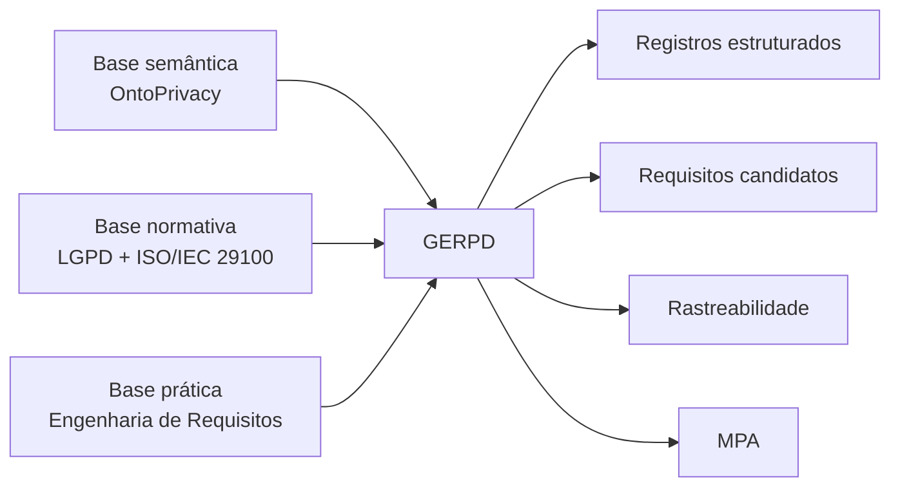
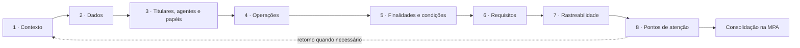
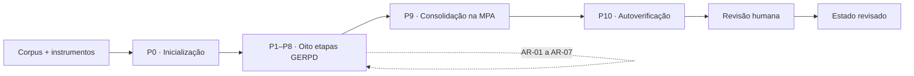

<div align="center">

# 🔐 GERPD — Guia para Engenharia de Requisitos de Privacidade de Dados

**Artefato técnico-operacional para identificação, organização, especificação, documentação e rastreabilidade de requisitos de privacidade em Engenharia de Software**


**Versão 1.0 · Agosto de 2026**

</div>

---

## 📌 Sobre o GERPD

O **Guia para Engenharia de Requisitos de Privacidade de Dados (GERPD)** é um instrumento técnico-operacional desenvolvido para apoiar a análise de aspectos de privacidade em artefatos de **Engenharia de Software (ES)**, com ênfase em atividades de **Engenharia de Requisitos (ER)**.

O guia utiliza a **OntoPrivacy** como base semântica para organizar e relacionar conceitos do domínio da privacidade de dados e adota a **Lei Geral de Proteção de Dados Pessoais (LGPD)** e a **ISO/IEC 29100** como principais fundamentos normativos. A proposta busca reduzir a distância entre a linguagem normativa da privacidade e a linguagem técnica utilizada na especificação, documentação e rastreabilidade de requisitos de software.

O processo do GERPD é organizado em **oito etapas encadeadas e iterativas**, cujas saídas são progressivamente relacionadas e, ao final, consolidadas na **Matriz Padrão de Aplicação (MPA)**. Essa estrutura permite registrar não apenas requisitos candidatos de privacidade, mas também dados pessoais, participantes, operações de tratamento, finalidades, condições, evidências, lacunas, pontos de atenção e vínculos de rastreabilidade.

> [!IMPORTANT]
> O GERPD é um **instrumento de apoio à análise e à especificação de requisitos de privacidade**. Ele não constitui mecanismo automático de conformidade e não substitui avaliações jurídicas, técnicas, organizacionais, de segurança ou de governança.

---

## 🎯 Objetivo

O objetivo do GERPD é:

> **Apoiar a identificação, a organização, a especificação, a documentação e a rastreabilidade de requisitos de privacidade em artefatos de Engenharia de Software, utilizando a OntoPrivacy como base semântica e a LGPD e a ISO/IEC 29100 como fundamentos normativos.**

Na prática, o guia busca tornar os aspectos de privacidade presentes — ou ausentes — nos artefatos analisados mais **explícitos, estruturados, rastreáveis e revisáveis**.

---

## 🧩 Fundamentos da proposta

O GERPD é sustentado por três bases complementares:

| Base | Referência principal | Papel no GERPD |
|---|---|---|
| **Semântica** | **OntoPrivacy** | Fornece o vocabulário controlado e as relações utilizadas para distinguir dados, pessoas, titulares, agentes, papéis, tratamentos e operações. |
| **Normativa** | **LGPD** e **ISO/IEC 29100** | Fornece conceitos, princípios, responsabilidades e referências para análise de tratamento de dados pessoais. |
| **Prática** | **Engenharia de Requisitos** | Fornece mecanismos para perguntas orientadoras, registros estruturados, derivação de requisitos, rastreabilidade, revisão e pontos de validação. |



---

## 🔄 Processo de aplicação

O GERPD organiza a análise em oito etapas interdependentes. As cinco primeiras constroem o cenário de tratamento; as três últimas derivam requisitos, registram a rastreabilidade e identificam lacunas ou necessidades de validação.

| Etapa | Atividade principal | Saída esperada |
|---:|---|---|
| **1** | Delimitar o contexto | Caracterização do contexto analisado |
| **2** | Mapear os dados pessoais | Lista estruturada de dados pessoais |
| **3** | Identificar titulares, agentes e papéis | Mapa de titulares, agentes e papéis |
| **4** | Caracterizar as operações de tratamento | Mapa de operações de tratamento |
| **5** | Analisar finalidade, autorização e condições | Quadro de finalidades, autorização e condições |
| **6** | Derivar requisitos de privacidade | Requisitos candidatos de privacidade |
| **7** | Registrar a rastreabilidade | Matriz de Rastreabilidade |
| **8** | Validar, revisar e registrar pontos de atenção | Pontos de atenção, lacunas e necessidades de validação |

Após a Etapa 8, as saídas são consolidadas na **Matriz Padrão de Aplicação (MPA)**. A consolidação na MPA **não constitui uma nona etapa**.



> [!NOTE]
> O processo é **iterativo**. Novos achados, lacunas ou inconsistências podem exigir retorno a etapas anteriores, com propagação das alterações às saídas dependentes.

---

## 🧠 Papel da OntoPrivacy

A **OntoPrivacy** atua transversalmente como base semântica do GERPD. Seu papel não é apenas fornecer termos, mas apoiar distinções conceituais relevantes durante a análise.

Entre os conceitos utilizados pelo guia estão:

- **Informação**;
- **Dado Pessoal** e **Dado Pessoal Sensível**;
- **Dado Anonimizado** e **Anonimidade**;
- **Pessoa**, **Pessoa Natural** e **Pessoa Jurídica**;
- **Titular de Dados Pessoais**;
- **Controlador**, **Operador** e **Terceiro**;
- **Ator**, **Ator Autorizado** e **Ator Desautorizado**;
- **Consentimento**;
- **Tratamento de Dados Pessoais**;
- **Tratamento de Dados Pessoais Autorizado**;
- **Operação de Tratamento de Dados Pessoais**;
- **Coleta**, **Armazenamento**, **Alteração**, **Recuperação**, **Consulta**, **Divulgação**, **Disponibilização** e **Exclusão**;
- **Anonimização** e **Pseudonimização**.

Termos operacionais ou normativos que não estejam representados na OntoPrivacy não devem ser apresentados como conceitos da ontologia apenas por serem relevantes à análise. Por exemplo, expressões como *dado acadêmico*, *dado financeiro*, *finalidade*, *necessidade*, *retenção*, *segurança* ou *requisito funcional* podem ser utilizadas contextualmente sem serem tratadas automaticamente como classes ontológicas.

---

## 👥 Público-alvo e formas de utilização

O GERPD pode ser utilizado por profissionais e equipes envolvidos na análise, especificação e revisão de sistemas que tratam dados pessoais, incluindo:

- engenheiros e analistas de requisitos;
- desenvolvedores e arquitetos de software;
- profissionais de privacidade e proteção de dados;
- profissionais de segurança da informação;
- equipes de governança e compliance;
- especialistas jurídicos;
- representantes de negócio e outras partes interessadas.

O guia admite três formas principais de utilização:

| Forma | Descrição |
|---|---|
| **Aplicação humana** | Um profissional ou equipe percorre as etapas e registra as saídas. |
| **Aplicação apoiada por IA Generativa** | Uma ferramenta auxilia na análise e produção das saídas, que permanecem preliminares até revisão humana. |
| **Aplicação híbrida** | Atividades de análise e revisão são distribuídas entre profissionais e ferramentas de IA Generativa. |

> [!CAUTION]
> Quando houver apoio de IA Generativa, as **saídas originais devem ser preservadas** e os resultados devem ser **revisados por responsáveis humanos** antes de sua adoção.

---

## ✅ O que o GERPD busca apoiar

O GERPD foi estruturado para apoiar:

- identificação de informações relacionadas à privacidade nos artefatos analisados;
- organização de dados pessoais, titulares, agentes, papéis e operações de tratamento;
- explicitação de finalidades, condições, restrições e lacunas documentais;
- derivação de **requisitos candidatos de privacidade**;
- registro de evidências e fontes conceituais ou normativas;
- construção de vínculos de rastreabilidade;
- identificação de pontos que demandam validação jurídica, técnica, organizacional ou de segurança;
- consolidação dos achados na **Matriz Padrão de Aplicação (MPA)**;
- revisão e auditabilidade das decisões produzidas durante a aplicação.

## 🚫 O que o GERPD não busca fazer

O GERPD **não tem como finalidade**:

- garantir ou certificar conformidade integral com a LGPD;
- determinar automaticamente bases legais ou condições jurídicas de tratamento;
- substituir análises jurídicas, técnicas, organizacionais ou de segurança;
- substituir avaliações de impacto, auditorias ou testes de segurança;
- comprovar que requisitos ou controles foram implementados ou são efetivos;
- atribuir responsabilidades jurídicas apenas a partir de papéis técnicos presentes nos artefatos;
- eliminar a necessidade de validação com especialistas e partes interessadas.

---

# 📂 Estrutura deste diretório

A pasta `GERPD/` reúne o **documento oficial do guia**, os **templates reutilizáveis**, as **figuras do artefato** e os materiais completos do **Estudo II**, no qual o GERPD foi aplicado de forma demonstrativa.

```text
GERPD/
│
├── README.md
│
├── 01_Documento_Oficial/
│   ├── README.md
│   ├── GERPD_v1.0.pdf
│   └── GERPD_v1.0.docx
│
├── 02_Templates/
│   ├── README.md
│   ├── Template_MPA_v1.0.xlsx
│   ├── Template_Matriz_Rastreabilidade_v1.0.xlsx
│   └── Template_Revisao_Humana_v1.0.xlsx
│
├── 03_Figuras/
│   ├── README.md
│   ├── Figura_01_Fundamentos_e_Construcao_GERPD.png
│   ├── Figura_02_Visao_Geral_Processo_GERPD.png
│   └── Figura_03_Estrutura_e_Formacao_MPA.png
│
└── EstudoII/
    ├── README.md
    ├── 00_Documentacao/
    ├── 01_Corpus_e_Instrumentos/
    ├── 02_Prompts/
    ├── 03_Respostas_Brutas/
    ├── 04_Saidas_Etapas/
    ├── 05_Adendos_Retorno/
    ├── 06_Rastreabilidade/
    ├── 07_Revisao_Humana/
    ├── 08_MPA/
    ├── 09_Autoverificacao/
    ├── 10_Indicadores/
    ├── 11_Figuras/
    └── 12_Reprodutibilidade/
```

Cada pasta e subpasta possui um `README.md` próprio, contendo a finalidade do diretório, a descrição dos arquivos e informações sobre proveniência, interpretação e relação com a dissertação.

---

## 🗂️ Navegação rápida

| Diretório | Conteúdo | Quando consultar |
|---|---|---|
| [`01_Documento_Oficial/`](01_Documento_Oficial/) | GERPD v1.0 em PDF e DOCX | Para compreender integralmente o guia e suas regras de aplicação |
| [`02_Templates/`](02_Templates/) | Templates reutilizáveis | Para iniciar uma nova aplicação do GERPD |
| [`03_Figuras/`](03_Figuras/) | Figuras canônicas do guia | Para visualizar fundamentos, processo e formação da MPA |
| [`EstudoII/`](EstudoII/) | Aplicação demonstrativa completa | Para examinar corpus, prompts, respostas, saídas, revisão e resultados do estudo |

---

# 🧪 Estudo II — Aplicação demonstrativa do GERPD

A pasta [`EstudoII/`](EstudoII/) contém os materiais utilizados e produzidos em uma **aplicação integral do GERPD com apoio do ChatGPT** sobre artefatos de Engenharia de Software de um projeto acadêmico.

O Estudo II foi organizado como uma aplicação demonstrativa, exploratória e descritiva. Seu objetivo foi observar a operacionalização do GERPD sobre um corpus delimitado, preservando as entradas, os prompts, as respostas brutas, as saídas intermediárias, os retornos entre etapas, a consolidação na MPA, a autoverificação e a revisão humana posterior.

### Fluxo documental do Estudo II



### Principais indicadores da aplicação

| Indicador | Resultado |
|---|---:|
| Aplicações formais | **1** |
| Prompts executados | **11 (P0–P10)** |
| Etapas do GERPD percorridas | **8/8** |
| Adendos de Retorno | **7 (AR-01–AR-07)** |
| Dados pessoais mapeados | **37 DP** |
| Titulares, agentes e papéis | **9 AG** |
| Operações de tratamento | **41 OP** |
| Registros de finalidade/autorização/condições | **43 FA** |
| Requisitos candidatos | **45 brutos → 47 revisados** |
| Pontos de atenção | **20 brutos → 21 revisados** |
| Registros da MPA | **68 brutos → 71 revisados** |

> [!NOTE]
> Esses números caracterizam **esta aplicação específica** do GERPD. Eles não constituem métricas gerais de acurácia, eficácia, desempenho do ChatGPT ou conformidade com a LGPD.

---

## 📦 Estrutura do Estudo II

```text
EstudoII/
│
├── 00_Documentacao/          # Protocolo, metadados e mapa dos artefatos
├── 01_Corpus_e_Instrumentos/ # C01, C02, GERPD e OntoPrivacy usados na execução
├── 02_Prompts/               # P00–P10 exatamente como enviados
├── 03_Respostas_Brutas/      # Respostas P00–P10 preservadas sem edição
├── 04_Saidas_Etapas/         # Saídas completas das oito etapas
├── 05_Adendos_Retorno/       # AR-01–AR-07
├── 06_Rastreabilidade/       # Matriz bruta acumulada e matriz revisada
├── 07_Revisao_Humana/        # RH-01–RH-10 e estado humano revisado
├── 08_MPA/                   # MPA bruta e MPA revisada
├── 09_Autoverificacao/       # Relatório completo do Prompt 10
├── 10_Indicadores/           # Indicadores em XLSX, CSV, JSON e Markdown
├── 11_Figuras/               # Figuras derivadas dos resultados do Estudo II
└── 12_Reprodutibilidade/     # Instruções, manifesto, versionamento e relação com a dissertação
```

Para detalhes, consulte o [`README.md` específico do Estudo II](EstudoII/README.md).

---

## 📝 Principais artefatos disponibilizados

### Documento oficial

A versão de referência do GERPD está disponível em:

- [`GERPD_v1.0.pdf`](01_Documento_Oficial/GERPD_v1.0.pdf) — versão recomendada para leitura e citação;
- [`GERPD_v1.0.docx`](01_Documento_Oficial/GERPD_v1.0.docx) — versão editável do documento consolidado.

### Templates

A pasta [`02_Templates/`](02_Templates/) disponibiliza estruturas reutilizáveis para:

- **Matriz Padrão de Aplicação (MPA)**;
- **Matriz de Rastreabilidade**;
- **Registro de Revisão Humana**.

### Figuras do GERPD

A pasta [`03_Figuras/`](03_Figuras/) reúne representações gráficas utilizadas para explicar:

1. os fundamentos e a construção do GERPD;
2. a visão geral do processo de aplicação;
3. a estrutura e formação da MPA.

---

## 📊 Matriz de Rastreabilidade × MPA

Dois instrumentos centrais do GERPD possuem funções distintas:

| Instrumento | Momento | Foco |
|---|---|---|
| **Matriz de Rastreabilidade** | Produzida na **Etapa 7** | Relaciona requisitos candidatos a conceitos, fontes, dados, operações, agentes, artefatos e evidências |
| **Matriz Padrão de Aplicação (MPA)** | Produzida **após as oito etapas** | Consolida os diferentes tipos de achado de privacidade em uma estrutura integrada |

A MPA não substitui a Matriz de Rastreabilidade e a consolidação da MPA não representa uma etapa adicional do GERPD.

---

## 👁️ Revisão humana

Os resultados produzidos pelo GERPD podem exigir revisão posterior, especialmente em aplicações apoiadas por IA Generativa.

As decisões previstas para a revisão são:

| Status | Significado |
|---|---|
| **Aceito** | O achado está sustentado e não necessita de alteração |
| **Aceito com ajustes** | O núcleo do achado é mantido, mas algum elemento é corrigido ou complementado |
| **Rejeitado** | O achado não possui sustentação suficiente, está fora do escopo ou contém erro conceitual |
| **Pendente de validação** | A decisão depende de informação adicional ou de especialista/parte interessada |

A revisão humana deve permanecer distinguível da saída original. Em aplicações apoiadas por IA, recomenda-se preservar separadamente **estado bruto** e **estado revisado**.

---

## 📏 Critérios de qualidade

O GERPD utiliza cinco critérios qualitativos para apoiar a revisão das saídas:

1. **Completude** — cobertura das dimensões pertinentes e explicitação das ausências relevantes;
2. **Correção conceitual** — uso adequado dos conceitos e distinções da OntoPrivacy;
3. **Rastreabilidade** — existência de vínculos compreensíveis entre achados, requisitos, artefatos, evidências, conceitos e fontes;
4. **Utilidade** — potencial das saídas para apoiar análise, especificação, revisão e decisão em Engenharia de Requisitos;
5. **Clareza** — organização, objetividade e compreensibilidade dos registros.

Esses critérios **não** devem ser interpretados como pontuação de conformidade jurídica, eficácia geral do GERPD, usabilidade do guia ou desempenho de uma ferramenta de IA Generativa.

---

## 🚀 Como utilizar este repositório

### Para conhecer o GERPD

1. Leia o [`GERPD_v1.0.pdf`](01_Documento_Oficial/GERPD_v1.0.pdf).
2. Consulte as figuras em [`03_Figuras/`](03_Figuras/).
3. Examine os templates em [`02_Templates/`](02_Templates/).

### Para realizar uma nova aplicação

1. Delimite o sistema, processo, funcionalidade ou conjunto de artefatos que será analisado.
2. Selecione os artefatos de Engenharia de Software pertinentes.
3. Utilize a OntoPrivacy como referência semântica.
4. Percorra as oito etapas do GERPD na ordem definida, retornando a etapas anteriores quando necessário.
5. Preserve as evidências e identificadores produzidos.
6. Consolide as saídas na MPA.
7. Realize revisão humana dos resultados antes de adotá-los como decisão de projeto, negócio ou organização.

### Para examinar ou reproduzir metodologicamente o Estudo II

Acesse:

- [`EstudoII/README.md`](EstudoII/README.md) — visão geral do estudo;
- [`EstudoII/12_Reprodutibilidade/COMO_REPRODUZIR_ESTUDOII.md`](EstudoII/12_Reprodutibilidade/COMO_REPRODUZIR_ESTUDOII.md) — procedimento de reprodução;
- [`EstudoII/12_Reprodutibilidade/MANIFESTO_ARQUIVOS_EstudoII.csv`](EstudoII/12_Reprodutibilidade/MANIFESTO_ARQUIVOS_EstudoII.csv) — inventário dos materiais;
- [`EstudoII/12_Reprodutibilidade/RELACAO_ARQUIVOS_SECAO_4.3.md`](EstudoII/12_Reprodutibilidade/RELACAO_ARQUIVOS_SECAO_4.3.md) — relação entre arquivos e a Seção 4.3 da dissertação.

> [!IMPORTANT]
> Modelos de IA Generativa podem apresentar variabilidade entre execuções. A disponibilização dos artefatos busca permitir a **reprodução do procedimento e a auditoria das evidências**, não garantir a reprodução textual exata das respostas.

---

## 🔖 Versionamento

| Artefato | Versão de referência |
|---|---|
| GERPD | **v1.0** |
| Estudo II | **v1.0** |
| Protocolo de prompts | **v1.0** |
| OntoPrivacy utilizada no Estudo II | **v1** |

As versões utilizadas no Estudo II foram congeladas antes da execução formal. Para detalhes, consulte [`EstudoII/12_Reprodutibilidade/VERSIONAMENTO.md`](EstudoII/12_Reprodutibilidade/VERSIONAMENTO.md).

---

## 🔬 Transparência e reprodutibilidade

A organização deste repositório procura manter claramente separadas as diferentes naturezas de artefato:

- **entradas congeladas**;
- **prompts enviados**;
- **respostas brutas não editadas**;
- **saídas estruturadas por etapa**;
- **adendos de retorno**;
- **resultados brutos**;
- **autoverificação**;
- **revisão humana**;
- **resultados revisados**;
- **indicadores consolidados**.

Essa separação permite reconstruir o percurso da aplicação e distinguir o que foi produzido durante a execução formal daquilo que foi posteriormente revisado ou derivado para fins de análise.

---

## ⚠️ Limitações de interpretação

Ao utilizar os materiais deste repositório, considere que:

- os resultados dependem do conteúdo e do nível de detalhamento dos artefatos analisados;
- a ausência de informação em um artefato não comprova sua inexistência no sistema ou na organização;
- requisitos derivados devem ser tratados como candidatos até validação adequada;
- papéis técnicos não devem ser convertidos automaticamente em responsabilidades jurídicas;
- restrições técnicas de acesso não equivalem automaticamente a consentimento ou outra condição jurídica de tratamento;
- a presença de um conceito da OntoPrivacy não comprova conformidade normativa;
- aplicações apoiadas por IA Generativa exigem preservação da saída original e revisão humana posterior.

---

## 📚 Relação com a dissertação

O GERPD corresponde ao artefato desenvolvido no contexto da pesquisa sobre **OntoPrivacy, privacidade de dados e enriquecimento semântico de artefatos de Engenharia de Software**.

Na organização da dissertação:

- a **OntoPrivacy** fornece a base semântica;
- o **GERPD** operacionaliza essa base no contexto da Engenharia de Requisitos;
- o **Estudo II** demonstra a aplicação integral do GERPD com apoio do ChatGPT sobre artefatos de Engenharia de Software;
- os materiais deste repositório funcionam como evidências complementares para a descrição, análise e auditabilidade do estudo.

O conteúdo completo do Estudo II encontra-se em [`EstudoII/`](EstudoII/).

---

## 📖 Como citar

Ao utilizar o GERPD ou os materiais disponibilizados neste diretório, recomenda-se citar a **dissertação associada a este repositório** e indicar a versão do artefato utilizada.

Formato sugerido para identificação do artefato:

```text
Guia para Engenharia de Requisitos de Privacidade de Dados (GERPD), versão 1.0, agosto de 2026.
```

Para facilitar citações automatizadas, recomenda-se manter também um arquivo `CITATION.cff` na raiz geral do repositório da dissertação.

---

## 📄 Licenciamento e uso

Os direitos de uso, redistribuição e adaptação dos materiais deste repositório devem seguir a licença definida na raiz geral do projeto.

> [!WARNING]
> Caso a licença ainda não tenha sido definida, recomenda-se adicionar um arquivo `LICENSE` antes da publicação definitiva do repositório.

---

## 💬 Questões e contribuições

Dúvidas relacionadas ao conteúdo técnico, à organização dos artefatos ou à reprodução metodológica podem ser registradas por meio das **Issues** do repositório.

Ao reportar uma questão, recomenda-se informar:

- arquivo ou pasta relacionada;
- versão do artefato;
- etapa do GERPD envolvida, quando aplicável;
- descrição objetiva da dúvida, inconsistência ou proposta de melhoria.

---

## 🧭 Resumo de navegação

```text
Quero entender o GERPD
└── 01_Documento_Oficial/

Quero aplicar o GERPD
├── 01_Documento_Oficial/
└── 02_Templates/

Quero entender visualmente o processo
└── 03_Figuras/

Quero examinar a aplicação demonstrativa
└── EstudoII/

Quero ver as respostas originais da IA
└── EstudoII/03_Respostas_Brutas/

Quero verificar rastreabilidade
└── EstudoII/06_Rastreabilidade/

Quero verificar a revisão humana
├── EstudoII/07_Revisao_Humana/
└── EstudoII/08_MPA/

Quero utilizar os dados consolidados
└── EstudoII/10_Indicadores/

Quero auditar ou reproduzir o procedimento
└── EstudoII/12_Reprodutibilidade/
```

---

<div align="center">

**GERPD · Guia para Engenharia de Requisitos de Privacidade de Dados**  
**OntoPrivacy · LGPD · ISO/IEC 29100 · Engenharia de Requisitos**

*Material complementar de pesquisa acadêmica — versão 1.0, agosto de 2026.*

</div>
