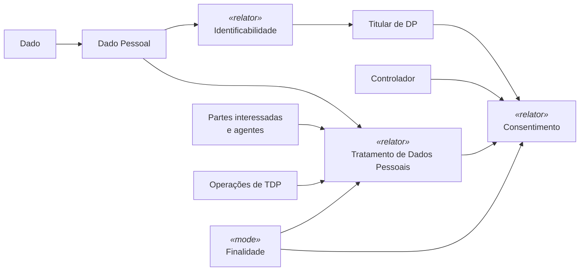
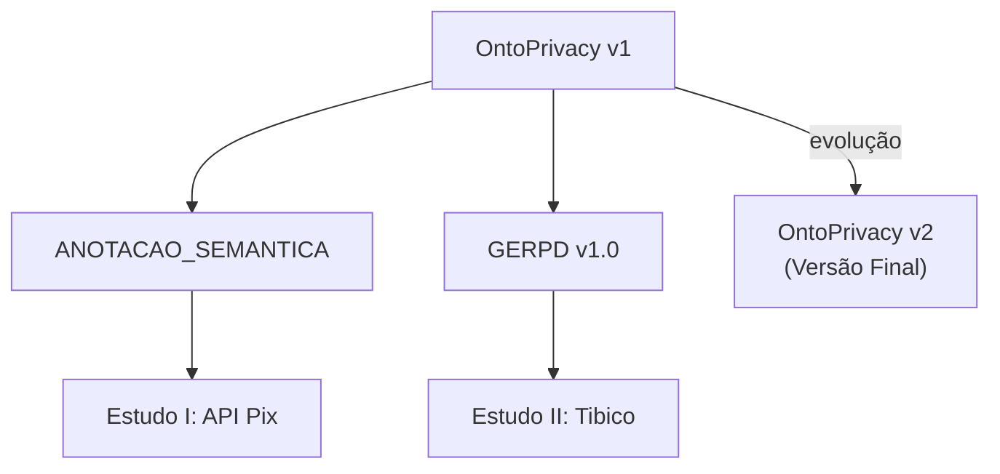

<div align="center">

# 🧠 OntoPrivacy - Ontologia de Privacidade de Dados

**Ontologia de referência de domínio para representação conceitual de privacidade de dados e enriquecimento semântico de artefatos de Engenharia de Software**


</div>

---

## 📌 Sobre a OntoPrivacy

A **OntoPrivacy** é uma **ontologia de referência de domínio**, em nível conceitual, destinada a representar um núcleo selecionado de conceitos relacionados à **privacidade de dados pessoais**. A ontologia é fundamentada principalmente na **Lei Geral de Proteção de Dados Pessoais (LGPD)** e na **ABNT NBR ISO/IEC 29100:2020**, utiliza o **SABiO** como orientação metodológica, adota a **Unified Foundational Ontology (UFO)** como fundamentação ontológica e é representada em **OntoUML**.

Seu propósito é fornecer uma conceituação compartilhada para apoiar:

- comunicação e aprendizagem sobre o domínio;
- redução de ambiguidades jurídico-técnicas;
- organização e rastreabilidade de conceitos de privacidade;
- enriquecimento semântico de descrições OpenAPI;
- apoio semântico à Engenharia de Requisitos de Privacidade de Dados.

> [!IMPORTANT]
> A OntoPrivacy não representa integralmente a LGPD, não determina Base Legal, não avalia licitude, não certifica conformidade e não substitui análise jurídica, técnica ou organizacional.

---

## 🏷️ Nota de versionamento

Na dissertação, a versão final congelada é denominada **OntoPrivacy v2**. Os arquivos técnicos preservam o identificador interno `v2`:

- `OntoPrivacy_v2.asta`;
- `OntoPrivacy_v2.png`.

A **OntoPrivacy v1** é a versão histórica publicada em Mori Junior et al. (2025) e efetivamente utilizada na abordagem de anotação, no GERPD v1.0 e nos Estudos I e II. A versão v2 é uma evolução conceitual posterior e não foi aplicada retroativamente.

Leia a política completa em [`VERSIONAMENTO.md`](./VERSIONAMENTO.md).

---

## 🌐 Modelo Conceitual

<p align="center">
  
</p>

> **Legenda acadêmica:** Ontologia de Privacidade de Dados - OntoPrivacy v2.  
> **Arquivo técnico:** `OntoPrivacy_v2.png`.

---

## 🔢 Inventário da versão final

| Elemento | Quantidade |
|---|:---:|
| Conceitos | **43** |
| Relações | **21** |
| Generalizações | **36** |
| Conjuntos de generalização | **07** |
| Restrições próprias | **01** |
| Atributos | **01** |
| Questões de Competência | **07** |
| Cenários de validação | **14** |

---

## 🧭 Arquitetura conceitual

A leitura da OntoPrivacy é organizada por três `relators` centrais:

```mermaid
flowchart LR
    %% --------------------------------------------------------
    %% PALETA DE CORES LÓGICA E ELEGANTE (MATERIAL DESIGN)
    %% --------------------------------------------------------
    %% Azul: Objetos passivos e dados
    classDef dado fill:#E3F2FD,stroke:#1565C0,stroke-width:2px,color:#1A1A1A;
    
    %% Ciano: Subtipos e operações
    classDef subkind fill:#E0F7FA,stroke:#00838F,stroke-width:2px,color:#1A1A1A;
    
    %% Laranja: Agentes (Pessoas/Organizações)
    classDef ator fill:#FFF3E0,stroke:#E65100,stroke-width:2px,color:#1A1A1A;
    
    %% Verde: Modos e Finalidades
    classDef mode fill:#E8F5E9,stroke:#2E7D32,stroke-width:2px,color:#1A1A1A;
    
    %% Roxo: Relatores (O "contrato" ou elo que une as partes)
    classDef relator fill:#F3E5F5,stroke:#6A1B9A,stroke-width:2px,color:#1A1A1A;

    %% --------------------------------------------------------
    %% AGRUPAMENTO 1: IDENTIFICABILIDADE
    %% --------------------------------------------------------
    subgraph G1 ["<b>1. IDENTIFICABILIDADE</b>&nbsp;"]
        D("<i>«kind»</i>\n<b>Dado</b>"):::dado
        DP("<i>«role»</i>\n<b>Dado Pessoal</b>"):::dado
        I("<b>Identificabilidade</b>\n<i>«relator»</i>"):::relator
        
        %% Sub-tipos de Identificabilidade
        IDIR("<i>«subkind»</i>\n<b>Direta</b>"):::subkind
        IIND("<i>«subkind»</i>\n<b>Indireta</b>"):::subkind
        
        T("<i>«role»</i>\n<b>Titular de DP</b>"):::ator
        
        %% Conexões Internas do G1
        D -->DP
        DP -->|possibilita a| I
        I -->|pode ser| IDIR
        I -->|pode ser| IIND
        I -->|refere-se ao| T
    end

    %% --------------------------------------------------------
    %% AGRUPAMENTO 2: TRATAMENTO DE DADOS PESSOAIS
    %% --------------------------------------------------------
    subgraph G2 ["<b>2. TRATAMENTO DE DADOS PESSOAIS (TDP)</b>&nbsp;"]
        TDP("<i>«relator»</i>\n<b>Tratamento de Dados Pessoais (TDP)</b>"):::relator
        
        O("<i>«subkind»</i>\n<b>Operação de TDP</b>"):::subkind
        CO("<i>«subkind»</i>\n<b>Conj. de Operações</b>"):::subkind
        
        P("<i>«rolemixin»</i>\n<b>Partes e Agentes</b>"):::ator
        CTRL("<i>«rolemixin»</i>\n<b>Controlador</b>"):::ator
        OPR("<i>«rolemixin»</i>\n<b>Operador</b>"):::ator
        
        F("<i>«mode»</i>\n<b>Finalidade</b>"):::mode
        
        %% Conexões Internas do G2
        O -->|compõe um| CO
        O -->|é abrangida pelo| TDP
        CO -->|é abrangido pelo| TDP
        
        CTRL -.->|é tipo de| P
        OPR -.->|é tipo de| P
        P -->|envolvidas no| TDP
        
        TDP -->|possui uma ou mais| F
    end

    %% --------------------------------------------------------
    %% AGRUPAMENTO 3: CONSENTIMENTO
    %% --------------------------------------------------------
    subgraph G3 ["<b>3. CONSENTIMENTO</b>&nbsp;"]
        C("<i>«relator»</i>\n<b>Consentimento</b>"):::relator
    end

    %% --------------------------------------------------------
    %% CONEXÕES ENTRE OS AGRUPAMENTOS (CROSS-LINKS)
    %% --------------------------------------------------------
    
    %% Ligação Dado Pessoal -> TDP
    DP -->|é abrangido pelo| TDP
    
    %% Ligações do Consentimento
    T -->|manifesta o| C
    C -->|é dirigido ao| CTRL
    C -->|é relativo ao| TDP
    C -->|determina as| F

    %% --------------------------------------------------------
    %% ESTILIZAÇÃO DAS CAIXAS (CLEAN DESIGN)
    %% --------------------------------------------------------
    %% Fundos neutros (cinza super claro) para não ofuscar os nós coloridos
    style G1 fill:#F8F9FA,stroke:#B0BEC5,stroke-width:2px,color:#37474F,stroke-dasharray: 5 5,rx:10,ry:10
    style G2 fill:#F8F9FA,stroke:#B0BEC5,stroke-width:2px,color:#37474F,stroke-dasharray: 5 5,rx:10,ry:10
    style G3 fill:#F8F9FA,stroke:#B0BEC5,stroke-width:2px,color:#37474F,stroke-dasharray: 5 5,rx:10,ry:10
```





[![](https://mermaid.ink/img/pako:eNq9WM1u20YQfpUFgwA2ICkiaUoWGxig-WMQlSVBZIsgVQ8rcSVvSnHVJZnIjnLqoQ9Q9Al6KIoei556i16ss_yxSctWEsMODRj82f1mdma-b3b1XpqxgEi6NA_Zu9kF5gnqjyd8EiG4nj9HzQdeFYiR0bd9A1k2Modj20P97W9nrmkgG9l9-8wY-DY6ODd8e-wafRjluWeDw8f1wLhKQx0Np29IwmK0wnFM38INQQEOWFwOnIXwwSLz7C2a0zDUn9mqozhWI044-4noz2Sto5nt4rH5jgbJha6s1o0ZCxmHz4b4-6YErHhgUhwxHXnpNKGrzDRbEY63f27_JbsOxOn0JxoFpQ9tp-sY1z6028fqsfMAH_qY4-gN1pGxIFFCYnQwInHMcPxiyBc4oleFO4c7_uCE8cIZx3FUu33tjN3R5PZDAvI94QHR0TkLsmg4NMIhhcDfEQ1OFhyXsTh2NLt3bV6xu5aqPMD8mK0hHWMSiqWJUAzRBJgQJRxeTCTEUkRChn5OCUojgrCoGp7cFRueY5ThUW3N0a796xjyac_4HP8eueDPxt-NjHN74A-RrCPXgjvXAdKdun3XMiz7Ec1BsUJ-VhfoTEY_TKSX0xO5dYfFly-mJxPpx3KWuALKySyhLKpIjrisA4ChJx__FiT4-N_LF_RkMokA2AJi5jiHuq4Lmtamjcp5nIXk9jyUF3t4_3z3IPPeDYAddE5neErzksymAFAGnae7QM9wildVqOo9hBho38x5HxC0i19zwnLH5TIKGaitBEKW4Js1FENqCO7A2oPgRsGnMar3_n1R9WmShpiLNVmjG7hPxMJkEVkLmUEuiBCPgFqQnDO5lkkoyhNrVE-ueLeBGMZUxC3BCG-QW1t4MQL8iQnfZKHc-x0CtfudkznhpBkD6dkG-eUAkgfo6Wiq6MgfG37xBM0SSDP00Mj2vKHhek9CWKUgrNLaaxsd-Nbo8AsI7FeoWONLXjegsXgJJGBZ6YgWXJCTxlVTn8Gt4Z5CHxYN9o_MjF8t0Tsq3twHBTX7piVQhjdN-7P5U1OlJV3TqAo9ytoKdMCiKd_PI9Mf9_dCmaJ9sRDiye9HGY7Ge0GyFe5FqN47JdYSWFWFuenn1VxC2X25Mig19zOOzthyBQNRutxA4na_b_9CeAqbnQV4gFbQyDci__V03x7I7h54OwOo2crnCT2Hktig0a3wfmJErmMkesvCt-BejKL9Rv2K8qUUlozF5mQJXNkg56upk6pDyAaeaOrZiyeRI7WQI7VVN3aH8ph79AXqKBYtNpOYe6XkSUIGbtuvtr_DIQf8HtsIRLQSRRBSczz0vGbfHXzrPeYZp7rLp4tC9aq7HtQ8qRZZUVP7y38XVHATRtYCXI7yM8QlnCPmJIbuDFhm-c0srUHDoJkx0VsFnXZGZFmC01nefW-cyQcEBIRhCdoCO_Ki_B83gbbnw371tbH9dfsLdELDQ6bhvjJE5vq2MXia46mTRqIHRiQF_YYWOKPRFQZegBSLcwZnh-L0gVEkssrmaTyDXZeYsP0nRtlRglaOsXFyGRKxGS9OJMdOr3J6PG2f2qZ274lE7R51j64PlyBPF5hzfKkjDWkNvtbldoNfwv9bxpSvaUx9UmNSQ1pAPCU94SlpSEuoNywepffCiYmUXJAlmUg63HISpOtmhj-RJtEHmLrC0WvGluVsztLFhaTPcRjDU7oKcEIsikHvboaAEBFusjRKJF1W1XZDIgEFoTrPf5fJfp7JgCX9vbSW9Kbc6bWUrqKpXUWVj440tSFdSrpypLY68KhoHa0nd3vdDw3pKnNFbrU7xx21d9TtaIqitFX5w_8tajmx?type=png)](https://mermaid.live/edit#pako:eNq9WM1u20YQfpUFgwA2ICkiadoSGxig-WMQlSVBZIsgVQ8rcSVvQnGVJenIjnLqoQ9Q9Al6KIoei556i16ss_yxSctWEsMODRj82f1mdma-b3b1QZqygEi6NAvZ--k55gnqjcZ8HCG4nj9HzQdeFYih0bN9A1k2Mgcj20O9zW-nrmkgG9k9-9To-zbaOzN8e-QaPRjluaf9_cf1wLhKQx0NJm9IwmK0xHFML-CGoAAHLC4HTkP4YJFZ9hbNaBjqz2zVURyrESecvSX6M1k71Mx28dh8T4PkXFeWq8aUhYzDZ0P8fVcCVjwwKY6Yjrx0ktBlZpotCcebPzf_km0H4nTylkZB6UPbOXKMax_a7Y7acR7gQw9zHL3BOjLmJEpIjPaGJI4Zjl8M-BxH9KpwZ3_LH5wwXjjjOI5qt6-dsQ81uf2QgPxIeEB0dMaCLBoOjXBIIfB3RIOTOcdlLDqOZnevzSv2kaUqDzA_YitIx4iEYmkiFAM0BiZECYcXYwmxFJGQoXcpQWlEEBZVw5O7YsNzjDI8qq052rV_h4Z80jW-xL9HLvjT0Q9D48zu-wMk68i14M51gHQnbs-1DMt-RHNQrJCf5Tk6ldFPY-nl5Fhu3WHx5YvJ8Vj6uZwlroByMk0oiyqSIy5rD2Do8ae_BQk-_ffyBT0ejyMAtoCYOc6-ruuCprVpw3IeZyG5PQ_lxR7eP9_dy7x3A2AHndEpntC8JLMpAJRB5-ku0DOc4lUVqnoPIQbaN3PeBwRt49ecsNxRuYxCBmorgZAl-GYNxZAagtu3diC4UfB5jOq9f19UfZqkIeZiTdbwBu4zsTBZRFZCZpALIsQjoBYk51SuZRKK8tga1pMr3q0hhjEVcUswwmvk1hZejAB_YsLXWSh3fodAbX_nZEY4acZAerZGfjmA5AF6OpoqOvJHhl88QbME0gw8NLQ9b2C43pMQVikIq7R22kZ7vjXc_woC-xUq1viS1w1oLF4ACVhWOqIFF-SkcdXUF3BrsKPQB0WD_SMz41dL9I6KN3dBQc2-aQmUwU3T_mL-1FRpQVc0qkIPs7YCHbBoyvfzyPRHvZ1QpmhfLIR48vtRBsPRTpBshTsRqvdOibUAVlVhbvp5NZdQdl-vDErN_YyjU7ZYwkCULtaQuO3vm78QnsBmZw4eoCU08rXIfz3dtweyuwfezgBqtvJ5Qs-hJNZoeCu8nxmR6xiJLlh4Ae7FKNpt1K8oX0phyVhsThbAlTVyvpk6qTqErO-Jpp69eBI5Ugs5Ult1Y3coj7lDX6COYtFiM4m5V0qeJGTgtv1q8zsccsDvkY1ARCtRBCE1RwPPa_bc_vfeY55xqrt8Oi9Ur7rrQc3japEVNbW7_LdBBTdhZC3A5Sg_Q1zAOWJGYujOgGWW38zSGjQMmhkTvVXQaWtEliU4neXd98aZfEBAQBgWoC2wIy_K_3ETaHs-7FdfG5tfN79AJzQ8ZBruK0Nkrmcb_ac5njppJHpgRFLQb2iBUxpdYeAFSLE4Z3C2L04fGEUiq2yWxlPYdYkJm39ilB0laOUYGyeXIRGb8eJE0nG6ldPjSfvENrV7TyTq0cHRwfXhEuTpHHOOL3WkIa3BV7rcbvBL-H_LmPItjalPakxqSHOIp6QnPCUNaQH1hsWj9EE4MZaSc7IgY0mHW06CdNXM8MfSOPoIU5c4es3YopzNWTo_l_QZDmN4SpcBTohFMejdzRAQIsJNlkaJpMuq0mlIJKAgVGf57zLZzzMZsKR_kFaS3lS6By21q3aVdqfbOVCPtIZ0KelKW24daprWVlS5q6pa9-BjQ7rKfJFbyoGstTUNPsiKDEY-_g9qLjne)

### 1. Identificabilidade

Explica por que um `Dado` desempenha o papel de `Dado Pessoal` e a qual `Titular de DP` ele se refere. Pode ser **Direta** ou **Indireta**.

### 2. Tratamento de Dados Pessoais

Representa a situação relacional na qual `Dados Pessoais` são abrangidos por uma `Operação de TDP` ou por um `Conjunto de Operações`, envolvendo `Partes Interessadas`, `Controladores`, `Operadores` e `Finalidades`.

### 3. Consentimento

Representa a manifestação do `Titular de DP`, dirigida a um ou mais `Controladores`, relativa a um `TDP` e a `Finalidades` determinadas. A existência de `Consentimento` no modelo não implica validade jurídica ou licitude.

Leia a descrição completa em [`ONTOPRIVACY.md`](./ONTOPRIVACY.md).

---

## 🗂️ Estrutura deste diretório

```text
ONTOPRIVACY/
├── README.md
├── ONTOPRIVACY.md
├── VERSIONAMENTO.md
├── CHANGELOG.md
├── 01_MODELO/
│   ├── README.md
│   └── OntoPrivacy_v2.png
├── 02_METODOLOGIA/
│   ├── README.md
│   ├── SABIO_E_SABIOX.md
│   └── UFO_E_ONTOUML.md
├── 03_CATALOGO/
│   ├── README.md
│   ├── CATALOGO_ONTOPRIVACY_v2.xlsx
│   ├── CATALOGO_CONCEITOS_ONTOPRIVACY_v2.md
│   ├── CATALOGO_RELACOES_ONTOPRIVACY_v2.md
│   └── CATALOGO_ELEMENTOS_COMPLEMENTARES_v2.md
├── 04_VALIDACAO/
│   ├── README.md
│   ├── QUESTOES_COMPETENCIA_ONTOPRIVACY_v2.md
│   ├── MATRIZ_QC_CONCEITO_RELACAO_v2.md
│   ├── MATRIZ_COBERTURA_QC_v2.xlsx
│   ├── CENARIOS_VALIDACAO_ONTOPRIVACY_v2.md
│   ├── RELATORIO_VALIDACAO_CONCEITUAL_v2.md
│   └── LIMITES_ESCOPO_QCS_v2.md
├── 05_RASTREABILIDADE/
│   ├── README.md
│   ├── MATRIZ_CONCEITO_FONTE_v2.xlsx
│   ├── MATRIZ_CONCEITO_FONTE_v2.md
│   └── REGISTRO_DECISOES_ONTOPRIVACY_v2.md
├── 06_HISTORICO/
│   ├── README.md
│   └── OntoPrivacy_v1.png
└── 07_REFERENCIAS/
    └── REFERENCIAS.md
```

---

## 🧩 Navegação rápida

| Diretório / arquivo | Conteúdo | Quando consultar |
|---|---|---|
| [`ONTOPRIVACY.md`](./ONTOPRIVACY.md) | descrição acadêmica detalhada | para compreender propósito, conceitos, relações e limites |
| [`01_MODELO/`](./01_MODELO/) | ASTA e PNG canônicos | para abrir ou visualizar o modelo |
| [`02_METODOLOGIA/`](./02_METODOLOGIA/) | SABiO, SABiOx, UFO e OntoUML | para compreender método e fundamentação |
| [`03_CATALOGO/`](./03_CATALOGO/) | catálogo de conceitos, relações e elementos | para consultar definições e classificações |
| [`04_VALIDACAO/`](./04_VALIDACAO/) | QCs, cenários e cobertura | para examinar a avaliação conceitual |
| [`05_RASTREABILIDADE/`](./05_RASTREABILIDADE/) | fontes e decisões | para rastrear a origem e a governança dos elementos |
| [`06_HISTORICO/`](./06_HISTORICO/) | OntoPrivacy v1 e evolução | para compreender a versão aplicada nos estudos |
| [`07_REFERENCIAS/`](./07_REFERENCIAS/) | referências bibliográficas | para citação e aprofundamento |

---

## ✅ Questões de Competência

| QC | Questões de Competência | Dimensão |
|:---:|---|:---:|
| **QC1** | Quais dados são pessoais, sensíveis, pseudonimizados ou anonimizados? | Dados e Classificação |
| **QC2** | A quem cada dado pessoal se refere e como ocorre a identificação: direta ou indireta? | Titular e Identificabilidade |
| **QC3** | Quem participa do tratamento e qual papel desempenha? | Participantes e Papéis |
| **QC4** | Quais operações de tratamento são realizadas sobre os dados pessoais? | Tratamento, Dados e Operações |
| **QC5** | Para qual finalidade o tratamento é realizado, quem a define e a quem é informada? | Finalidade e Responsabilidade |
| **QC6** | Quem consente com qual tratamento, perante qual controlador e para quais finalidades? | Consentimento |
| **QC7** | Que dados resultam da anonimização ou pseudonimização e qual condição de identificação permanece? | Operação e condições resultantes |

As versões formais e o mapeamento completo estão em [`04_VALIDACAO/`](./04_VALIDACAO/).

---

## 🔬 Avaliação conceitual

A avaliação da OntoPrivacy foi conduzida por meio de:

- catálogo de conceitos e relações;
- matriz de rastreabilidade Conceito–Fonte;
- análise de cobertura das sete QCs;
- sete cenários positivos;
- sete cenários negativos ou limítrofes;
- inspeção da mobilização dos 43 conceitos e das 21 relações.

O resultado indica que as sete QCs são conceitualmente respondíveis. Essa avaliação é **conceitual e documental**: não corresponde a validação jurídica, prova de completude do domínio ou execução de raciocinador formal.

---

## 🔗 Relação com os demais artefatos



A pasta `ONTOPRIVACY/` documenta a versão final. As aplicações históricas permanecem nos diretórios [`../ANOTACAO_SEMANTICA/`](../ANOTACAO_SEMANTICA/) e [`../GERPD/`](../GERPD/).

---

## 📖 Ordem recomendada de leitura

1. `README.md`;
2. `ONTOPRIVACY.md`;
3. `02_METODOLOGIA/SABIO_E_SABIOX.md`;
4. `02_METODOLOGIA/UFO_E_ONTOUML.md`;
5. `03_CATALOGO/README.md`;
6. `04_VALIDACAO/README.md`;
7. `VERSIONAMENTO.md`.

---

## 📚 Publicação relacionada à versão inicial

MORI JUNIOR, D.; NARDI, J. C.; RUY, F. B.; TEIXEIRA, G. F. **Apoio na adoção da Lei Geral de Proteção de Dados Pessoais por meio de anotações semânticas em descrições de serviços Web**. *Em Questão*, v. 31, e-139608, 2025. DOI: `10.1590/1808-5245.31.139608`.

---

<div align="center">

**OntoPrivacy · Ontologia de Privacidade de Dados**  
**Conceitos · Privacidade de Dados · LGPD · ISO/IEC 29100 · Engenharia de Software**

*`Material complementar de pesquisa acadêmica | versão 1.0, agosto de 2026.`*

</div>
