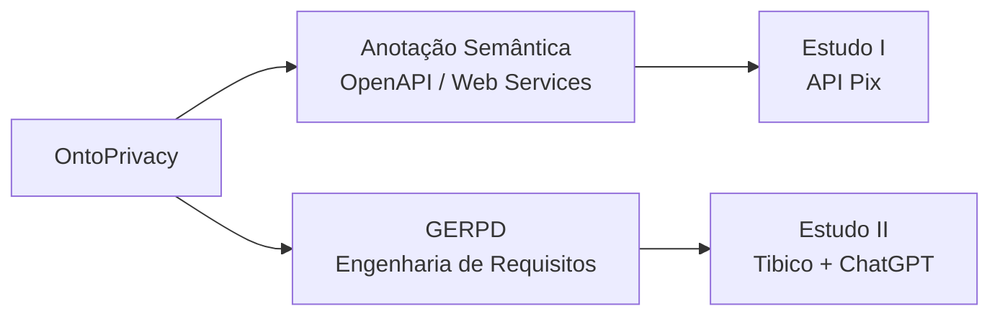

# Dissertação — OntoPrivacy, Privacidade de Dados e Engenharia de Software


> **Título do Trabalho:** [Insira aqui o Título da sua Dissertação]  
> **Autor(a):** [Seu Nome Completo]  
> **Orientador(a):** [Nome do Orientador]  
> **Coorientador(a):** [Nome do Coorientador, se houver]  
> **Instituição:** [Nome da Universidade/Faculdade] — [Programa de Pós-Graduação / Curso]  
> **Ano:** [Ano de Defesa]

---

## 📌 Sobre este Repositório

Este repositório reúne todo o material suplementar, artefatos técnicos, dados, códigos e documentação complementar desenvolvidos e utilizados na elaboração da dissertação de mestrado descrita acima. 

Repositório de apoio aos artefatos, materiais de aplicação e evidências produzidos no desenvolvimento de uma dissertação de mestrado no IFES, situada na interseção entre **Ontologias**, **Privacidade de Dados**, **LGPD** e **Engenharia de Software**.

O objetivo deste repositório é promover a **transparência, reprodutibilidade e continuidade** da pesquisa acadêmica realizada.

> [!IMPORTANT]
> Este repositório documenta artefatos acadêmicos e aplicações demonstrativas. Nenhum material aqui deve ser interpretado como certificação de conformidade com a LGPD ou como substituto de avaliação jurídica, técnica, organizacional ou de segurança.

---

## Visão geral

A pesquisa utiliza a **OntoPrivacy** como base conceitual para apoiar duas formas complementares de enriquecimento semântico de artefatos de Engenharia de Software:



| Eixo | Desenvolvimento | Aplicação | Diretório |
|---|---|---|---|
| OntoPrivacy | Seção 3.1 | Base semântica comum | materiais distribuídos nos eixos de aplicação |
| Anotação Semântica | Seção 3.2 | Estudo I — Seção 4.2 | [`ANOTACAO_SEMANTICA/`](./ANOTACAO_SEMANTICA/) |
| GERPD | Seção 3.3 | Estudo II — Seção 4.3 | [`GERPD/`](./GERPD/) |

---

## 📂 Estrutura do Repositório

Abaixo está a organização dos arquivos contidos neste repositório:

```text
.
├── 📄 docs/              # Documentos suplementares (formulários, aprovação em comitê de ética, anexos)
├── 📊 data/              # Conjuntos de dados (datasets brutos, higienizados e tabelas auxiliares)
├── 💻 src/               # Scripts, códigos-fonte e algoritmos desenvolvidos na pesquisa
├── 📊 results/           # Gráficos, tabelas de resultados e relatórios gerados
├── 📝 templates/         # Modelos de questionários, entrevistas ou formulários de coleta
└── 📄 README.md          # Visão geral do repositório
```

### Organização do repositório

```text
/Dissertacao/
├── README.md
├── .gitignore
├── ANOTACAO_SEMANTICA/
│   └── ...
└── GERPD/
    └── ...
```

### `ANOTACAO_SEMANTICA/`

Contém a documentação da abordagem de anotação semântica definida na Seção 3.2, o modelo visual da OntoPrivacy empregado como referência, o protótipo **Privacy Finder** e o pacote reprodutível do **Estudo I**.

### `GERPD/`

Contém o Guia para Engenharia de Requisitos de Privacidade de Dados e os materiais correspondentes ao Estudo II. Esse eixo é mantido separadamente porque possui processo, instrumentos e evidências próprios.

---

## Princípios de organização adotados

1. **Separação entre método e aplicação:** a abordagem geral fica em `ANOTACAO_SEMANTICA/`, enquanto o corpus, os registros e os resultados da API Pix ficam em `ANOTACAO_SEMANTICA/EstudoI/`.
2. **Preservação do corpus:** a especificação original da API Pix permanece separada da versão anotada.
3. **Rastreabilidade:** decisões de anotação, pontos de validação, resultados sumarizados e verificações técnicas são documentados em arquivos próprios.
4. **Não extrapolação:** ausência de evidência no contrato OpenAPI não é interpretada como ausência de tratamento de dados na implementação.
5. **Reprodutibilidade técnica:** o pacote inclui dados de entrada, resultado anotado, ferramenta auxiliar e script de validação estrutural.

---

## Repositórios e fontes de referência

- Repositório principal da dissertação: [TNK443/Dissertacao](https://github.com/TNK443/Dissertacao)
- Primeira publicação histórica do Privacy Finder: [TNK443/Streamit](https://github.com/TNK443/Streamit)
- Especificação de referência da API Pix: [bacen/pix-api](https://github.com/bacen/pix-api)

---

## Como navegar

Para compreender a proposta de anotação, comece em [`ANOTACAO_SEMANTICA/README.md`](./ANOTACAO_SEMANTICA/README.md). Para reproduzir a aplicação da API Pix, vá diretamente para [`ANOTACAO_SEMANTICA/EstudoI/README.md`](./ANOTACAO_SEMANTICA/EstudoI/README.md). Para executar o Privacy Finder, consulte [`ANOTACAO_SEMANTICA/PrivacyFinder/README.md`](./ANOTACAO_SEMANTICA/PrivacyFinder/README.md).
