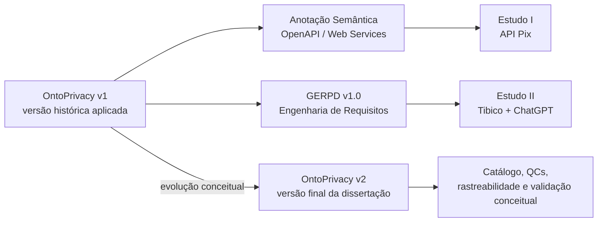

<div align="center">

# Dissertação: OntoPrivacy, Privacidade de Dados e Engenharia de Software

</div>

 **.**


-Anotacao%20Semantica-0b5d7a?style=flat-square) **.**


-GERPD-d97706?style=flat-square) **.**


> **Título do Trabalho:** [Insira aqui o Título da sua Dissertação]  
> **Autor:** [Seu Nome Completo]  
> **Orientador:** [Nome do Orientador]  
> **Instituição:** Instituto Federal do Espírito Santo (Ifes) — Campus Serra  
> **Programa:** Programa de Pós-Graduação em Computação Aplicada (PPComp) — Mestrado Profissional em Computação Aplicada  
> **Ano:** 2026

---

## 📌 Sobre este repositório

Este repositório reúne todo o material suplementar, artefatos técnicos, dados, códigos e documentação complementar desenvolvidos e utilizados na elaboração da dissertação de mestrado descrita acima

Repositório de apoio aos artefatos, materiais de aplicação e evidências produzidos no desenvolvimento de uma dissertação de mestrado no IFES, situada na interseção entre **Ontologias**, **Privacidade de Dados**, **LGPD** e **Engenharia de Software**.

O objetivo deste repositório é promover a **transparência, reprodutibilidade e continuidade** da pesquisa acadêmica realizada.

> [!IMPORTANT]
> Este repositório documenta artefatos acadêmicos e aplicações demonstrativas. Nenhum material aqui deve ser interpretado como certificação de conformidade com a LGPD ou como substituto de avaliação jurídica, técnica, organizacional ou de segurança.

---

## 🧭 Visão geral da pesquisa e política de versões



| Artefato / eixo | Papel na dissertação | Base ontológica | Aplicação | Diretório |
|---|---|---|---|---|
| **OntoPrivacy v2** | Seção 3.1 — ontologia final de referência | versão conceitual final | não aplicada retroativamente aos estudos | [`OntoPrivacy/`](./OntoPrivacy/) |
| **Anotação Semântica** | Seção 3.2 — OE02(a) | OntoPrivacy v1 | Estudo I — API Pix / OE03 | [`ANOTACAO_SEMANTICA/`](./ANOTACAO_SEMANTICA/) |
| **GERPD v1.0** | Seção 3.3 — OE02(b) | OntoPrivacy v1 | Estudo II — Tibico + ChatGPT / OE04 | [`GERPD/`](./GERPD/) |

> [!NOTE]
> Na dissertação, a versão final congelada é denominada **OntoPrivacy v2**.
> O trabalho tem como objetivo geral desenvolver uma ontologia de domínio para privacidade de dados e utilizá-la como fundamentação no **enriquecimento semântico de artefatos de Engenharia de Software**. A pesquisa investiga duas formas complementares de aplicação:
>
> 1. anotação semântica de descrições **OpenAPI / Web Services**;
> 2. apoio à **Engenharia de Requisitos de Privacidade de Dados** por meio do GERPD.

---

## 📂 Estrutura do repositório

```text
/Dissertacao/
├── README.md
├── .gitignore
├── OntoPrivacy/
│   ├── README.md
│   ├── ONTOPRIVACY.md
│   ├── VERSIONAMENTO.md
│   ├── CHANGELOG.md
│   ├── 01_MODELO/
│   ├── 02_METODOLOGIA/
│   ├── 03_CATALOGO/
│   ├── 04_VALIDACAO/
│   ├── 05_RASTREABILIDADE/
│   ├── 06_HISTORICO/
│   └── 07_REFERENCIAS/
├── ANOTACAO_SEMANTICA/
│   ├── README.md
│   ├── PrivacyFinder/
│   └── EstudoI/
└── GERPD/
    ├── README.md
    ├── 01_Documento_Oficial/
    ├── 02_Templates/
    ├── 03_Figuras/
    └── EstudoII/
```

### [`OntoPrivacy/`](./OntoPrivacy/)

Reúne a **versão conceitual final da ontologia**, o diagrama, a documentação metodológica, o Catálogo OntoPrivacy, as Questões de Competência, os cenários de validação e as matrizes de rastreabilidade.

### [`ANOTACAO_SEMANTICA/`](./ANOTACAO_SEMANTICA/)

Reúne a abordagem de anotação semântica apresentada na Seção 3.2, a OntoPrivacy v1 utilizada nesse eixo, as extensões OpenAPI, o Privacy Finder e o pacote reprodutível do Estudo I sobre a API Pix.

### [`GERPD/`](./GERPD/)

Reúne o GERPD v1.0, seus templates e figuras, bem como o pacote completo do Estudo II. O guia e o estudo preservam o vocabulário da OntoPrivacy v1 utilizado durante sua execução.

---

## 🧠 OntoPrivacy em síntese

A **OntoPrivacy v2** é uma ontologia de referência de domínio, em nível conceitual, fundamentada principalmente na **LGPD** e na **ABNT NBR ISO/IEC 29100:2020**, desenvolvida com apoio do **SABiO**, fundamentada em **UFO** e representada em **OntoUML**.

Sua arquitetura é organizada por três entidades relacionais centrais:

- **Identificabilidade** — relaciona `Dados Pessoais` ao `Titular de DP` e distingue identificação direta e indireta;
- **Tratamento de Dados Pessoais** — relaciona dados, participantes, operações e `Finalidade`'s;
- **Consentimento** — relaciona `Titular de DP`, `Controlador`, `TDP` e `Finalidade`'s determinadas.

A documentação pública inclui **43 conceitos**, **21 relações**, **7 conjuntos de generalização**, **7 Questões de Competência** e **14 cenários de validação conceitual**.

➡️ Comece em [`OntoPrivacy/README.md`](./OntoPrivacy/README.md).

---

## 🧩 Princípios de organização

1. **Separação entre artefato conceitual e aplicações:** a OntoPrivacy final possui diretório próprio; os estudos permanecem em seus eixos históricos.
2. **Preservação de versões:** OntoPrivacy v1 e v2 não são tratadas como intercambiáveis.
3. **Rastreabilidade:** conceitos, relações, fontes, QCs e cenários são documentados em arquivos próprios.
4. **Não extrapolação:** ausência de evidência em um artefato não é interpretada automaticamente como ausência de tratamento, papel, Consentimento ou Finalidade.
5. **Preservação do corpus:** entradas originais, resultados anotados, respostas brutas e revisões humanas permanecem separados.
6. **Reprodutibilidade:** os pacotes incluem os artefatos necessários para inspeção e repetição das verificações documentadas.
7. **Limites explícitos:** a OntoPrivacy não determina Base Legal, licitude ou conformidade jurídica.

---

## 🔎 Como navegar

1. Para compreender a ontologia final, consulte [`OntoPrivacy/README.md`](./OntoPrivacy/README.md).
2. Para uma descrição acadêmica detalhada, leia [`OntoPrivacy/ONTOPRIVACY.md`](./OntoPrivacy/ONTOPRIVACY.md).
3. Para examinar o modelo, acesse [`OntoPrivacy/01_MODELO/`](./OntoPrivacy/01_MODELO/).
4. Para estudar SABiO, UFO e OntoUML, acesse [`OntoPrivacy/02_METODOLOGIA/`](./OntoPrivacy/02_METODOLOGIA/).
5. Para reproduzir o Estudo I, acesse [`ANOTACAO_SEMANTICA/EstudoI/`](./ANOTACAO_SEMANTICA/EstudoI/).
6. Para examinar o Estudo II, acesse [`GERPD/EstudoII/`](./GERPD/EstudoII/).

---

## 📚 Publicação relacionada à OntoPrivacy v1

MORI JUNIOR, D.; NARDI, J. C.; RUY, F. B.; TEIXEIRA, G. F. **Apoio na adoção da Lei Geral de Proteção de Dados Pessoais por meio de anotações semânticas em descrições de serviços Web**. *Em Questão*, v. 31, e-139608, 2025. DOI: `10.1590/1808-5245.31.139608`.

---

## 🔗 Repositórios e fontes de referência

- Repositório principal: [TNK443/Dissertacao](https://github.com/TNK443/Dissertacao)
- Repositório histórico do Privacy Finder: [TNK443/Streamit](https://github.com/TNK443/Streamit)
- Especificação de referência da API Pix: [bacen/pix-api](https://github.com/bacen/pix-api)
- Documentação da linguagem OntoUML: [OntoUML Specification](https://ontouml.readthedocs.io/)

---

<div align="center">

**Dissertação: OntoPrivacy, Privacidade de Dados e Engenharia de Software**  
**OntoPrivacy · Anotação Semântica · GERP**

*Material complementar de pesquisa acadêmica — versão 1.0, agosto de 2026.*

</div>
